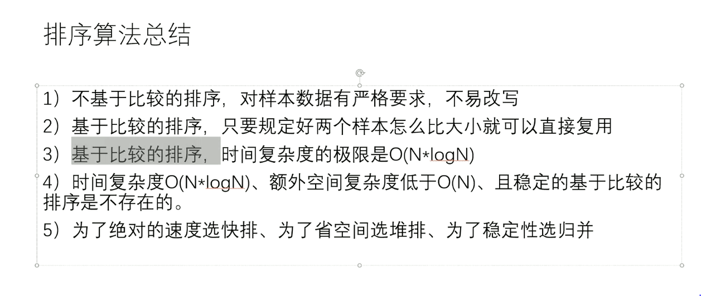
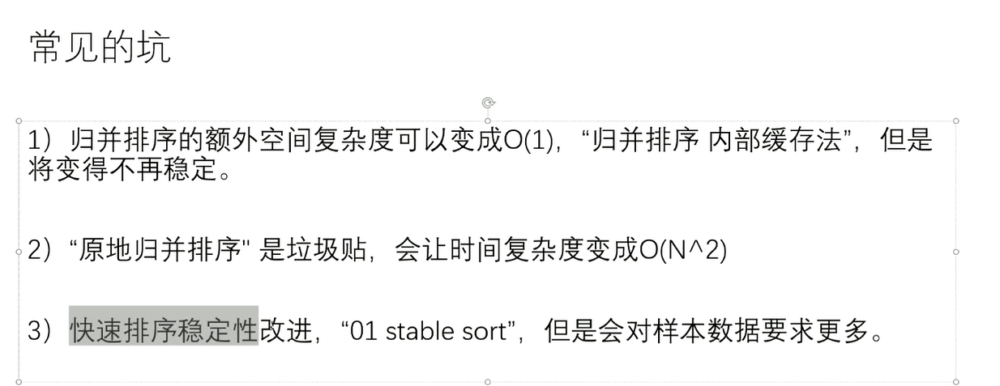

# 马士兵左程云数据结构与算法基础

# 课程1

## 1、选择排序 selectorSort

```java
package com.flt.sort;

import java.util.Arrays;

/**
 * @ClassName: SelectSortDemo.java
 * @author: FULITAO
 * @description:选择排序 复杂度是N的平方
 * @createTime: 2021年07月17日 13:06:00
 */
public class SelectSortDemo {


    public static void selectSort(int[] arr) {
        if (arr == null || arr.length < 2) {
            return;
        }
        //  0~n-1
        //  1~n-1
        //  2~n-1
        for (int i = 0; i < arr.length - 1; i++) {
            //先记录最小值的index
            int minIndex = i;
            for (int j = i + 1; j < arr.length; j++) {
                minIndex = arr[minIndex] > arr[j] ? j : minIndex;
            }
            swap(arr, i, minIndex);
        }
    }


    public static void swap(int[] arr, int i, int j) {
        int temp = arr[i];
        arr[i] = arr[j];
        arr[j] = temp;
    }

    // for test
    public static void comparator(int[] arr) {
        Arrays.sort(arr);
    }

    //for test  产生一个随机数组
    public static int[] generateRandomArray(int maxSize, int maxValue) {
        int[] arr = new int[(int) ((maxSize + 1) * Math.random())];
        for (int i = 0; i < arr.length; i++) {
            arr[i] = (int) (((maxValue + 1) * Math.random()) - ((maxValue + 1) * Math.random()));
        }
        return arr;
    }


    public static void main(String[] args) {
        int[] arr = generateRandomArray(20,20);
        selectSort(arr);
        System.out.println(Arrays.toString(arr));
    }

}

```

**过程:**

1、先让0~n-1上有序     进行n次的 看 比 

2、在让1~n-1上有序   进行n-1此的看  比

时间复杂度是O(N^2)

## 2、冒泡排序(BubbleSort)

```java
package com.flt.sort;

import java.util.Arrays;

/**
 * @ClassName: BubleSelect.java
 * @author: FULITAO
 * @description:冒泡排序
 * @createTime: 2021年07月17日 13:16:00
 */
public class BubbleSelectDemo {

    public static void bubbleSelect(int[] arr) {
        if (arr == null || arr.length < 2) {
            return;
        }
        for (int e = arr.length - 1; e > 0; e--) {
            for (int i = 0; i < e; i++) {
                if (arr[i] > arr[i + 1]) {
                    swap(arr, i, i + 1);
                }
            }
        }
    }

    public static void swap(int[] arr, int i, int j) {
        arr[i] = arr[i] ^ arr[j];
        arr[j] = arr[i] ^ arr[j];
        arr[i] = arr[i] ^ arr[j];
    }

    public static void main(String[] args) {
        int[] arr = {5, 4, 3, 2, 1};
        bubbleSelect(arr);
        System.out.println(Arrays.toString(arr));
    }
}

```

**过程**

先让a[0]和a[1]比较  若a[0]比[a1]大就交换  一直到a[n-1]

**复杂度O(N^2)**

## 3、插入排序(InsertSort)

```java
package com.flt.sort;

import java.util.ArrayList;
import java.util.Arrays;

/**
 * @ClassName: InsertSelector.java
 * @author: FULITAO
 * @description:
 * @createTime: 2021年07月17日 13:34:00
 */
public class InsertSelectorDemo {

    public static void insertSelector(int[] arr) {
        //思想就是
        //0~0上有序
        //0~1上有序
        //0~2上有序
        //0~i上有序
        for (int i = 1; i < arr.length; i++) {
            //里面的for循环 就是做到 0~i上有序的操作
            for (int j = i - 1; j >= 0 && arr[j] > arr[j + 1]; j--) {
                swap(arr, j, j + 1);
            }
        }
    }


    public static void swap(int[] arr, int i, int j) {
        arr[i] = arr[i] ^ arr[j];
        arr[j] = arr[i] ^ arr[j];
        arr[i] = arr[i] ^ arr[j];
    }

    public static void main(String[] args) {
        int[] arr = {5, 4, 3, 2, 1};
        insertSelector(arr);
        System.out.println(Arrays.toString(arr));
    }
}

```

**过程:**

先让0~0上有序

在让0~1上有序 从1的位置往前看 要是 arr[0]>arr[1]两个交换

**时间复杂度与数据的状态有关 最好的时候是O(1)最坏的时候是O(N^2)**

## 4、二分法(Binary Search)

**时间复杂度:O(logN)**

### 1、查找最左边大于等于Value的值得index

```java
package com.flt.binarysearch;

import java.util.Arrays;

/**
 * @ClassName: NearLeftDemo.java
 * @author: FULITAO
 * @description:找到最左边大于等于value的下标
 * @createTime: 2021年07月17日 14:27:00
 */
public class NearLeftDemo {

    public static int nearestIndex(int[] arr, int value) {
        //用于记录最左边大于等于value的index
        int index = -1;
        //左指针
        int l = 0;
        //右指针
        int r = arr.length - 1;

        while (l <= r) {
            //计算中点
            int mid = l + ((r - l) >> 1); //等价于 mid (l+r)/2
            if (arr[mid] >= value) {
                index = mid;
                r = mid - 1;
            } else {
                l = mid + 1;
            }
        }
        return index;
    }


    // for test
    public static int comparator(int[] arr, int maxValue) {
        int i = -1;
        for (int j = 0; j < arr.length; j++) {
            if (arr[j] >= maxValue) {
                i = j;

            }
        }

        return i;
    }

    //for test  产生一个随机数组
    public static int[] generateRandomArray(int maxSize, int maxValue) {
        int[] arr = new int[(int) ((maxSize + 1) * Math.random())];
        for (int i = 0; i < arr.length; i++) {
            arr[i] = (int) (((maxValue + 1) * Math.random()) - ((maxValue + 1) * Math.random()));
        }
        return arr;
    }

    public static void main(String[] args) {

    }

}

```

### 2、局部最小值问题

## 5、异或运算

**简单来说就是不进位的加法运算**

 **性质:**

**异或运算满足交换律和分配率 所以异或的顺序不影响最后的结果**

**N=N^0**

**0=N^N**

### 1、不申请新的变量交换两个变量的值

```java
package com.flt.xor;

/**
 * @ClassName: SwapVariableNotTemplate.java
 * @author: Cheems
 * @description:不申请变量交换两个变量的值
 * @createTime: 2021年07月19日 16:10:00
 */
public class SwapVariableNotTemplate {
    public static void main(String[] args) {
        int a = 6;
        int b = 10;
        a = a ^ b;
        b = a ^ b;
        a = a ^ b;

        System.out.println(a);
        System.out.println(b);
    }
}

```

### 2、一个数组只有一种数打印了奇数次，其他都出现了偶数次，如何打印出现奇数次的数

**通过特性0=N^N一个数出现了偶数次他最后的结果一定是0，一个数出现了奇数次他的结果就是他这个数的本身**

```java
    //打印了出现奇数次个数的数
    public static void printOddTimesNum1(int[] arr) {
        int xor=0;
        for (int i = 0; i < arr.length; i++) {
            xor^=arr[i];
        }
        System.out.println(xor);
    }
```

### 3、一个数组只有两种数打印了奇数次，其他都出现了偶数次，如何打印出现奇数次的数

**思路**

第一次异或的值肯定是这两个数异或的结果 如 N=a^b

从中我们可以得知  a在某一位上是0 b就是1 要么a是0 b是1  我们可以通过找到这个异或的值最右边的1是哪位 然后就把数组分成那一位上是0的 或者是1的来进行分开异或，然后就因为他是出现的奇数次这次异或的值就是 N=a^b中的某一位

```java

    //打印两个出现奇数次个数的数
    public static void printOddTimesNum2(int[] arr) {
        int xor = 0;
        for (int i = 0; i < arr.length; i++) {
            //第一次异或的值 是这两个出现奇数次的值得 结果
            xor ^= arr[i];
        }
        //取出异或结果的最右边的1
        //xor与上他的补码就能得到他最右边的1
        int onlyOne = xor & ((~xor) + 1);
        //第二次异或的值 取在onleOne这个值上有1的数进行异或
        int xor2 = 0;
        for (int i = 0; i < arr.length; i++) {
            if ((onlyOne & arr[i]) > 0) {
                xor2 ^= arr[i];
            }
        }
        System.out.println("第一个数" + xor2);
        System.out.println("第二个数" + (xor ^ xor2));
    }
```

### 4、计算某个数的二进制1的个数

**思路**

把一个数的最右侧的1取出来

然后再将这个数与最右侧的1进行异或操作  就能抹掉这个1

例子:

N				001110111001

onlyOne	000000000001

^				  001110111000

```java
    public static void bitCounter(int number) {
        int counter = 0;
        while (number != 0) {
            int nearOne = number & ((~number) + 1);
            counter++;
            number ^= nearOne;
        }


        System.out.println("一共有" + counter);
    }

```

# 课程2

## 1、链表

### 1、反转链表

**单向链表**

```java
  public static Node reverserLinkedList(Node head) {
        Node pre = null;
        Node next = null;
        while (head != null) {
            next = head.next;
            head.next = pre;
            pre = head;
            head = next;    
        }

        return pre;
    }
```


**双向链表**

```
public static Node reverserLinkedList(Node head) {
    Node pre = null;
    Node next = null;
    while (head != null) {
        next = head.next;
        head.next = pre;
        head.last=next;
        pre = head;
        head = next;    
    }

    return pre;
}
```

### 2、删除节点

```java
    public static Node removeValue(Node head, int value) {
        //这个循环是找到第一个不等于3的位置
        while (head != null) {
            if (head.value == value) {
                break;
            }
            head = head.next;
        }
        //pre指针只是为了记录前一个节点  即不等于3的位置的节点
        Node pre = head;
        Node cur = head;
        while (cur != null) {
            if (cur.value == value) {
                //找到等于value的节点
                pre.next = cur.next;
            } else {
                //没有找到等于value的节点就把pre提过来这里
                pre = cur;
            }
            cur = cur.next;
        }
        return head;
    }
```

## 2、栈和队列

### 1、实现一个特殊的栈，有基本功能还能返回一个最小值 

**要求他们push  poll  以及 getMin都是O(1)的时间复杂度**

**思路：使用两个栈即可 一个栈存数据，另一个栈存最小值,最小值的栈如何入栈，当要入栈的数据小于最小值栈的栈顶元素就入栈，出栈的话就是当前数据栈出的栈等于最小值栈栈顶的元素就出栈**

```java
 public class StackDemo {
    public Stack<Integer> dataStack;
    public Stack<Integer> miniStack;

    public StackDemo() {
        this.dataStack = new Stack<>();
        this.miniStack = new Stack<>();
    }

    public void push(int value) {
        dataStack.push(value);
        if (miniStack.empty()) {
            miniStack.push(value);
        } else {
            if (miniStack.peek() > value) {
                miniStack.push(value);
            }
        }
    }

    public int pop() {
        int value = dataStack.pop();
        if (miniStack.peek() == value) {
            miniStack.pop();
        }

        return value;
    }


    public int getMini() {
        return miniStack.peek();
    }
}
```

### 2、如何用栈结构实现一个队列

**思路:使用两个栈即可，一个导入栈，一个导出栈，当导出栈不为空的时候就出的是导出栈，当为空的时候从导入栈导入所有的数据进导出栈即可**

```java
public class StackDemo {
    public Stack<Integer> push;
    public Stack<Integer> pop;

    public StackDemo() {
        this.push = new Stack<>();
        this.pop = new Stack<>();
    }

    public void push(Integer var1) {
        push.push(var1);
        pushToPop();

    }

    public Integer pop(){
        pushToPop();
        if(pop.isEmpty()){
            throw new RuntimeException("队列为空无法出队");
        }
        return pop.pop();
    }


    public void pushToPop() {
        if (this.pop.isEmpty()) {
            while (!push.isEmpty()) {
                pop.push(push.pop());
            }
        }
    }

```


### 3、如何使用队列结构实现一个栈

**思路:使用两个队列，假如先插入1、2、3 、4 、5进入数据栈，此时用户需要取一个数据这时候就把1 、2 、3 、4导出到Help栈然后返回数据栈最后一个元素即可，这不操作做完之后hlep栈和data栈交换变量的指向**

```java
    public Queue<Integer> data;
    public Queue<Integer> help;

    public QueueDemo() {
        this.data = new ArrayDeque<>();
        this.help = new ArrayDeque<>();
    }

    public void push(int value) {
        this.data.add(value);
    }

    public void pop() {
        if (data.size() == 0) {
            throw new RuntimeException("当前栈为空");
        }
        for (int i = 0; i < data.size() - 1; i++) {
            help.add(data.poll());
        }
        int value = data.poll();
        Queue<Integer> temp = help;
        help = data;
        data = temp;
    }
}
```

## 3、递归

###  1、通过递归求数组的最大值

```java
package com.flt.recuresion;


/**
 * @ClassName: GetMaxDemo.java
 * @author: Cheems
 * @description:通过递归求arr[0,leng]上最大值
 * @createTime: 2021年07月19日 22:18:00
 */
public class GetMaxDemo {
    public int getMax(int[] arr) {
        return process(arr, 0, arr.length - 1);
    }

    public int process(int[] arr, int left, int right) {
        if (left == right) {
            return arr[left];
        }
        int mid = left + ((right - left) >> 1);
        int leftValue = process(arr, left, mid);
        int rightValue = process(arr, mid + 1, right);
        return Math.max(leftValue, rightValue);
    }
}

```

### 2、求递归的时间复杂度

**对于某一类递归行为他的时间复杂度是可以确定的如下:**
$$
T(N)=aT(\frac{N}{b})+O(N^d)----------a,b,d都是常数
$$
**其中**
$$
aT(\frac{N}{b})代表是子问题的复杂度 调用了a次
$$

$$
O(N^d)是除了子问题调用的复杂度外的
$$

**对于这种满足这个表达式的递归有以下的性质**


$$
(1) log_ba>d----------------O(N^{log_ba})
$$

$$
(2) log_ba<d----------------O(N^d)
$$

$$
(3) log_ba==d--------------------------O(N^d*logN)
$$

# 课程3

## 1、归并排序

**递归版本**

```java
  public static void sort(int arr[]) {
        if (arr == null || arr.length < 2) {
            return;
        }
        process(arr, 0, arr.length - 1);
    }

    /**
     * 思想就是 给定一个数组arr，进行分解成 左边的子数组有序 和右边子数组有序的小问题
     * 即 l~mid 上有序  mid+1~r上有序 l和r分别是数组的开始和结束的位置
     * 在把左右两边有序的情况 通过一个help数组进行排序使他们整体有序
     * [1,3,5]
     * [2,4,6]
     * 定义两个指针 p1 和 p2 一个指向1的位置一个指向2的位置
     * help数组的长度等于这两个数组的长度之和
     * 然后进行判断 arr[p1]<=arr[p2]的话 把arr[p1]拷贝进help数组 p1++反之也是
     * 然后在把help数组有序的数重新拷贝回原来的arr
     * 但是要从l位置开始拷贝
     */

    public static void process(int[] arr, int l, int r) {
        if (l == r) {
            return;
        }
        int mid = l + ((r - l) >> 1);
        //使半边有序
        process(arr, l, mid);
        //使右半边有序
        process(arr, mid + 1, r);
        //进行整体运行
        merger(arr, l, mid, r);
    }


    public static void merger(int[] arr, int l, int m, int r) {

        //创建两个边界里数个数的大小
        int[] help = new int[r - l + 1];
        //这个i是用于插入help的位置所使用的
        int i = 0;
        int p1 = l;
        int p2 = m + 1;
        while (p1 <= m && p2 <= r) {
            help[i++] = arr[p1] <= arr[p2] ? arr[p1++] : arr[p2++];
        }
        while (p1 <= m) {
            help[i++] = arr[p1++];
        }
        while (p2 <= r) {
            help[i++] = arr[p2++];
        }
        //此时的help数组就是 arr上左右两边子数组有序的情况
        for (i = 0; i < help.length; i++) {
            arr[i + l] = help[i];
        }

    }
```

**时间复杂度O(N*logN)**

### 1、最小和:在一个数组中，一个数的左边比它小的数的总和，叫做数的小和，所有小和累加起来叫数组的小和

> 例子:[1,3,4,2,5]
>
> 1左边比1小的数：没有
>
> 3左边逼3小的数:1个1
>
> 4左边比4小的数:1个3 1个1
>
> 2左边比2小的数:1个1
>
> 5左边比5小的数:1、3、4 、2
>
> 所以数组的小和为:1+1+3+1+1+3+4+2=16

**利用归并排序的保存有序性的特性来进行实现,在merge操作中只有左组的数比右组的数小的时候才进行最小和的提取；反之右组大于或等于左组的情况都不做提取**

```java
public class SmallSumDemo {
    public static void main(String[] args) {
        int[] arr = {1, 3, 4, 2, 5};
        System.out.println(smallSum(arr));
    }


    public static int smallSum(int[] arr) {
        if (arr == null || arr.length < 2) {
            return 0;
        }
        return process(arr, 0, arr.length - 1);
    }


    public static int process(int[] arr, int l, int r) {
        if (l == r) {
            return 0;
        }
        int mid = l + ((r - l) >> 1);
        return process(arr, l, mid) + process(arr, mid + 1, r) + merge(arr, l, mid, r);
    }


    public static int merge(int[] arr, int l, int m, int r) {
        int res = 0;
        int[] help = new int[r - l + 1];
        int p1 = l;
        int p2 = m + 1;
        int i = 0;
        while (p1 <= m && p2 <= r) {
            res += arr[p1] < arr[p2] ? (r - p2 + 1) * arr[p1] : 0;
            //他这里调换位置无所谓的，都是拿右边所有的和这个来进行比较所以
            help[i++] = arr[p1] < arr[p2] ? arr[p1++] : arr[p2++];
        }
        while (p1 <= m) {
            help[i++] = arr[p1++];
        }
        while (p2 <= r) {
            help[i++] = arr[p2++];
        }
        for (int j = 0; j < help.length; j++) {
            arr[j + l] = help[j];
        }
        return res;
    }
}
```

### 2、逆序对:左边的数比右边的大就称为这两个数为逆序对 比如数组{3,1,4,5}关于3有{3,1}关于1没有  这个代码有问题

```java
    public List<String> reverserOrder(int[] arr) {
        List<String> result = new ArrayList<>();
        process(result, arr, 0, arr.length - 1);
        return result;
    }

    public static void process(List<String> result, int[] arr, int l, int r) {
        if (l == r) {
            return;
        }
        int mid = l + ((r - l) >> 1);
        process(result, arr, l, mid);
        process(result, arr, mid + 1, r);
        merge(result, arr, l, mid, r);
    }

    public static void merge(List<String> result, int[] arr, int l, int m, int r) {
        int[] help = new int[r - l + 1];
        int i = 0;
        int p1 = l;
        int p2 = r;
        while (p1 <= m && p2 <= r) {
            if (arr[p1] > arr[p2]) {
                result.add("{" + arr[p1] + "," + arr[p2] + "}");
            }
            help[i++] = arr[p1] <= arr[p2] ? arr[p1++] : arr[p2++];
        }
        while (p1 <= m) {
            help[i++] = arr[p1++];
        }
        while (p2 <= r) {
            help[i++] = arr[p2++];
        }
        for (int j = 0; j < help.length; j++) {
            arr[l + j] = help[j];
        }
    }
```

**归并排序可以利用到解决某些 要求求出左边多少个数比他小或者右边多少个数比他大的情况**


## 2、随机快排

**在介绍快排先了解partition的思想:**

 **思想:假如给定一个数num要求你让arr的一部分是小于num另一部分是大于num的不要求这两部分有序，此时设置一个小于num的区域index初始值为-1，i用于标记数组是否溢出有两种情况当arr[i]的值小于等于num的时候此时arr[i]与小于区的下个元素进行交换，小于区并向右扩一位，反之i++**

```javva
  public static void partition(int[] arr, int num) {

        int i = 0;
        int minRangeIndex = -1;
        while (i < arr.length) {
            if (arr[i] <= num) {
                swap(arr,(++minRangeIndex), i);
            }
            i++;
        }
    }
```

**荷兰国旗问题:就是经典的三色问题假如给定一个num把一个数组分为三个区小于区等于区还有大于区该如何实现,这个算法其实用随机快排进行稍微改造一下即可,设置两个index一个标记着最小区的起点-1一个标记最大区的起点arr.leng;当arr[i]的数小于num的时候arr[i]与最小区的index下个一个数进行交换最小区向右扩;等于的时候i++不做交换操作；当arr[i]>num的时候把最大区向左缩小一位的位置和arr[i]交换，i不移动；因为交换过来的数没有查过所以不能++;结束条件就是i等于最大区的index时候跳出循环**

```java
    public static void partition2(int[] arr, int num) {
        int i = 0;
        int minRangeIndex = -1;
        int maxRangeIndex = arr.length;
        while (i != maxRangeIndex) {
            if (arr[i] > num) {
                swap(arr, i, maxRangeIndex - 1);
                maxRangeIndex--;
                continue;
            }
            if (arr[i] < num) {
                swap(arr, i, minRangeIndex + 1);
                minRangeIndex++;
            }
            i++;
        }
    }
```

```java
 	//荷兰国旗问题
	//要求在arr[l....r]的范围上将arr[r]作为分组的标记 要求:
    //1、小于arr[r]的在左边
    //2、大于arr[r]的在右边
    //3、相等的在中间
    //结果:返回等于arr[r]中间的数最左边的index以及最右边的index
    //例子:{3,1,2,4,5,3} 求0到arr.leng-1上的荷兰国旗
    //结果:{1,2,3,3,4,5}  返回坐标{2,3}
    public static int[] netherlandsFlag(int[] arr, int l, int r) {
        if (l > r) {
            return new int[]{-1, -1};
        }
        if (l == r) {
            return new int[]{l, r};
        }
        int less = l - 1;
        int more = r;//这里先把arr[r]划在大于区里到最后在进行交换
        int index = l;
        while (index < more) {
            if (arr[index] == arr[r]) {
                index++;
            } else if (arr[index] < arr[r]) {
                swap(arr, index++, ++less);
            } else {
                swap(arr, index, --more);
            }
        }
        //这里arr[r]还是等于区的数 这时候做个操作 将arr[r]和大于区的第一个数的下标进行交换
        //因为大于区的第一个数紧挨着等于区
        swap(arr, more, r);
        //返回arr[]等于区第一个数的坐标和第二数的坐标
        // 这里的more不用减去1  因为当前more这个下标的值已经和 arr[r]进行交换
        return new int[]{less + 1, more};
    }
```

**快排1.0**

**思想:规定在arr[l....r]范围上规定arr[r]作为num，对数组分为两个区<=区以及>区在进行partition之后可以确定more这个位置的数就是在这个数组上是有序的数,然后我们在分别递归左边的数组已经右边的数组每次确定一个迟早都能排序完 **

```java
public static void quickSort1(int[] arr) {
        if (arr == null || arr.length < 2) {
            return;
        }

        process1(arr, 0, arr.length - 1);
    }


    public static void process1(int[] arr, int l, int r) {
        if (l >= r) {
            return;
        }
        int m = partition(arr, l, r);
        process1(arr, l, m - 1);
        process1(arr, m + 1, r);
    }

    public static int partition(int[] arr, int l, int r) {
        int index = l;
        int less = l - 1;
        int more = r;
        while (index < more) {
            if (arr[index] > arr[r]) {
                swap(arr, index, --more);
            } else {
                swap(arr, index++, ++less);
            }
        }
        swap(arr, more, r);
        return more;
    }
```

**复杂度O(N^2)**

**快排2.0借助荷兰旗子问题保留等于区以减少递归的次数**

```java
 public static void quickSort2(int[] arr) {
        process2(arr, 0, arr.length - 1);
    }

    public static void process2(int[] arr, int l, int r) {
        if (l >= r) {
            return;
        }
        int[] coords = partition2(arr, l, r);
        process2(arr, l, coords[0] - 1);
        process2(arr, r, coords[1] + 1);
    }

    public static int[] partition2(int[] arr, int l, int r) {
        if (l > r) {
            return new int[]{-1, -1};
        }
        if (l == r) {
            return new int[]{l, r};
        }
        int index = l;
        int less = l - 1;
        int more = r;
        while (index < more) {
            if (arr[index] == arr[r]) {
                index++;
            } else if (arr[index] < arr[r]) {
                swap(arr, index++, ++less);
            } else {
                swap(arr, index, --more);
            }
        }
        swap(arr, more, r);
        return new int[]{less + 1, more};
    }
```

**复杂度O(N^2)**


**快排3.0**

**为什么通过1.0 和2.0它们的时间复杂度都是O(N^2)可是快排的定义是O(N*logN)的复杂度这是为啥呢，因为上面的算法我们都是严格要求数组arr[r]作为num来判断他很容易导致一种状况就是左右两边递归的规模不一样，然后我们只要随机选取arr[]中的某一个数来进行随机快拍：根据随机的原理我们可以知道每种情况的出现的概率为1/N然后根据随机率的加法 他无限趋近与O(N\*logN)**

```java
  public static void quickSort3(int[] arr) {
        process3(arr, 0, arr.length - 1);
    }

    public static void process3(int[] arr, int l, int r) {
        if (l >= r) {
            return;
        }
        int randomOffset = (int) (Math.random() * (r - l + 1));
        //加上這區話就能實現 O(N*logN)的效果
        swap(arr, l + randomOffset, r);
        int[] coords = partition3(arr, l, r);
        process3(arr, l, coords[0] - 1);
        process3(arr, coords[1] + 1, r);
    }

    public static int[] partition3(int[] arr, int l, int r) {
        if (l > r) {
            return new int[]{-1, -1};
        }
        if (l == r) {
            return new int[]{l, r};
        }
        int index = l;
        int less = l - 1;
        int more = r;
        while (index < more) {
            if (arr[index] == arr[r]) {
                index++;
            } else if (arr[index] < arr[r]) {
                swap(arr, index++, ++less);
            } else {
                swap(arr, index, --more);
            }
        }
        swap(arr, more, r);
        return new int[]{less + 1, more};
    }
```


# 课程4

## 1、堆

**大根堆的结构**

```java
public class HeapDemo {
    public int[] heap;
    public final int limit;
    public int heapSize;

    public HeapDemo(int limit) {
        this.limit = limit;
        this.heap = new int[limit];
        heapSize = 0;
    }

    public boolean empty() {
        return heapSize == 0;
    }

    public boolean isFull() {
        return heapSize == limit;
    }

    public void push(int value) {
        if (isFull()) {
            throw new RuntimeException("Heap is Full");
        }
        heap[heapSize] = value;
        insertHeap(heapSize++);
    }

    public int pop() {
        if (empty()) {
            throw new RuntimeException("Heap Is Empty");
        }
        int maxValue = heap[0];
        swap(0, --heapSize);
        heapIfy();
        return maxValue;
    }

    //进行插入操作整理最大堆顺序
    public void insertHeap(int index) {
        while (this.heap[index] > this.heap[(index - 1) / 2]) {
            swap(index, (index - 1) / 2);
            index = (index - 1) / 2;
        }
    }

    //进行弹出操作 重新调整最大堆的性质
    public void heapIfy() {
        int left = 1;
        int iargest;
        int index = 0;
        while (left < heapSize) {
            //这里就是判断是这个节点的做儿子大还是又儿子大
            iargest = (left + 1) < heapSize && heap[left] < heap[left + 1] ? left + 1 : left;
            //这个if分支是 判断 头结点是否大于子节点 大于就直接退出
            if (heap[index] > heap[iargest]) {
                break;
            }
            swap(index, iargest);
            index = iargest;
            left = index * 2 + 1;
        }
    }


    public void swap(int i, int j) {
        heap[i] = heap[i] ^ heap[j];
        heap[j] = heap[i] ^ heap[j];
        heap[i] = heap[i] ^ heap[j];

    }
}
```

**堆排序**

**未优化版本**

```java
 public static void heapSort(int[] arr) {
        if (arr == null || arr.length < 2) {
            return;
        }
        for (int i = 0; i < arr.length; i++) { //这一步的复杂度是O(N*logN)
            insertHeap(arr, i);
        }
        int heapSize = arr.length;
        swap(arr, 0, --heapSize);
        while (heapSize > 0) { //这一步复杂度O(N*logN)
            heapIfy(arr, 0, heapSize);
            swap(arr, 0, --heapSize);
        }
    }


    public static void insertHeap(int[] arr, int index) {
//        while (this.heap[index] > this.heap[(index - 1) / 2]) {
//            swap(index, (index - 1) / 2);
//            index = (index - 1) / 2;
//        }
        while (arr[index] > arr[(index - 1) / 2]) {
            swap(arr, index, (index - 1) / 2);
            index = (index - 1) / 2;
        }

    }


    public static void heapIfy(int[] arr, int index, int heapSize) {
        int left = index * 2 + 1;
        int largest = -1;
        while (left < heapSize) {
            largest = (left + 1) < heapSize && arr[left] < arr[left + 1] ? left + 1 : left;
            if (arr[index] > arr[largest]) {
                break;
            }
            swap(arr, largest, index);
            index = largest;
            left = index * 2 + 1;
        }
    }


    public static void swap(int[] arr, int i, int j) {
        int temp = arr[i];
        arr[i] = arr[j];
        arr[j] = temp;
    }
```


**题目1：已知一个几乎有序的数组，几乎有序是指，如果把数组排好序的话，每个元素移动的距离不超过K，并且K相对于数组长度说是比较小的，请选择一个合适的排序策略，对于这个数组进行排序**

**思路：因为i->i=0;i->i+1=1;i->i-1=1,当如何判断这个数组的0位置的数到底是啥的时候，就把k+1个数放进小根对里面保证k位置的数就算最坏的情况移动到最左边也是小于k的，然后弹出小根堆的最小值然后在进一个数**


```java
package com.flt.heap;

import java.util.PriorityQueue;

/**
 * @ClassName: SortArrDistanceLessK.java
 * @author: Cheems
 * @description: 已知一个几乎有序的数组，几乎有序是指，如果把数组排好序的话，
 * 每个元素移动的距离不超过K，并且K相对于数组长度说是比较小的，请选择一个合适的排序策略
 * ，对于这个数组进行排序
 * @createTime: 2021年07月21日 21:50:00
 */
public class SortArrDistanceLessKDemo {
    public void sortArrDistanceLessK(int[] arr, int k) {
        //这个优先队列默认实现的是最小堆
        PriorityQueue<Integer> heap = new PriorityQueue<>();
        int index = 0;
        //首先把0到K的数装进最小堆中
        for (; index <= Math.min(arr.length - 1, k); index++) {
            heap.add(arr[index]);
        }
        int i = 0;
        for (; index < arr.length; i++, index++) {
            //第一步把a[0]的位置确定下来然后在从1~k的位置进行最小堆操作
            arr[i] = heap.poll();
            heap.add(arr[index]);
        }
        while (!heap.isEmpty()) {
            arr[i++] = heap.poll();
        }
    }

}

```

**时间复杂度每次入堆的操作是logK级别的  有n个数要操作 所以是 O(N*logK)**

**特殊的堆：有个resign改变堆中某个元素的值，让这个最大堆重新有序**

```java
package com.flt.heap;

import java.util.*;

/**
 * @ClassName: HeapDemo2.java
 * @author: Cheems
 * @description:
 * @createTime: 2021年07月21日 22:17:00
 */
public class HeapDemo2 {


    public static class MyHeap<T> {
        //因为只有动态数组才能接收 泛型T
        private ArrayList<T> heap;
        //记录每个泛型T处于堆中那个位置
        private Map<T, Integer> indexMap;
        private Integer heapSize;
        //这里的比较器适用于T泛型的对象进行比较
        private Comparator<T> comparator;

        public MyHeap(Comparator<T> comparator) {
            this.comparator = comparator;
            this.heap = new ArrayList<>();
            this.heapSize = 0;
            this.indexMap = new HashMap<>();
        }

        public boolean isEmpty() {
            return this.heapSize == 0;
        }

        public boolean contains(T o) {
            return indexMap.get(o) != null;
        }

        public void push(T o) {
            if (contains(o)) {
                //要是已经存在的话要求用户调用resign方法
                throw new RuntimeException("Object exists the  Heap,Please invoke Resign method");
            }
            this.heap.add(o);
            indexMap.put(o, heapSize);
            heapInsert(heapSize++);


        }

        public T pop() {
            T ans = heap.get(0);
            int end = heapSize - 1;
            heap.remove(end);
            indexMap.remove(ans);
            heapSize--;
            heapIfy(0);
            return ans;
        }


        public void heapInsert(int index) {
            while (comparator.compare(heap.get(index), heap.get((index - 1) / 2)) > 0) {
                swap(index, (index - 1) / 2);
                index = (index - 1) / 2;
            }
        }

        public void heapIfy(int index) {
            int left = index * 2 + 1;
            int largest = -1;
            while (left < heapSize) {
                largest = (left + 1) < heapSize && comparator.compare(heap.get(left), heap.get(left + 1)) < 0 ? left + 1 : left;
                if (comparator.compare(heap.get(largest), heap.get(index)) > 0) {
                    swap(largest, index);
                }
                index = largest;
                left = index * 2 + 1;
            }
        }

        public void resign(T o) {
            if (!contains(o)) {
                throw new RuntimeException("Object is not exists the heap,please invoke push method");
            }
            Integer ansIndex = indexMap.get(o);
            heapInsert(ansIndex);
            heapIfy(ansIndex);
        }


        //这里的swap比较特别因为得保证 heap和indexMap里的信息同步更新
        public void swap(int i, int j) {
            T o1 = heap.get(i);
            T o2 = heap.get(j);
            heap.add(j, o1);
            heap.add(i, o2);
            indexMap.put(o1, j);
            indexMap.put(o2, i);

        }
    }
}

```


# 课程5

## 1、前缀树Trie


**第一种实现:使用数组代表路**

```java
    //思想:先构造一个空的节点作为头结点，从空节点往下找字符的路是否存在不存在就
    //创建 存在就复用
    //这种树的每个节点都存的是char类型的字符

    public static class Node1 {
        //代表这个节点通过了多少次  即多少个字符串以这个几点为prefix
        public int pass;
        //代表这个插入的字符串有多少个以这个节点为suffix
        public int end;
        //这个数组存的就是往下走的节点
        public Node1[] nexts;

        public Node1() {
            this.pass = 0;
            this.end = 0;
            //规定不管大写，只管小写的字母a~z一共有26个 他撑死都不回超过这个数组
            this.nexts = new Node1[26];
        }
    }

    public static class Tree1 {
        //代表前缀树的根节点
        public Node1 root;

        public Tree1() {
            //构造一个空节点作为结构树的根节点  一切插入操作穿过这棵树的的根节点pass都++
            this.root = new Node1();
        }

        public void insert(String str) {
            if (str == null) {
                return;
            }
            //遍历字符串的每个字符
            char[] chars = str.toCharArray();
            //构建一个用于操作每个节点的变量
            //插入操作只要执行根节点的root的pass++
            Node1 node = root;
            node.pass++;
            //这个index就是用于标记该走那条路  因为我们用数组来存储他的路的方向
            // 用char-'a'的asii码 比如'a'-'a'=0即认为数组nexts[0]的位置就是a的路
            //'b'-'a'=1认为nexts[1]的位置就是b的路 等等
            int index = 0;

            for (int i = 0; i < chars.length; i++) {
                //从左往右遍历每个char
                index = chars[i] - 'a';
                if (node.nexts[index] == null) {
                    //不存在路的话就创建一个新的节点
                    node.nexts[index] = new Node1();
                }
                node = node.nexts[index];
                node.pass++;
            }
            //因为for循环出来就到了字符串的结尾的节点 直接end++
            node.end++;
        }


        public void delete(String str) {
            //插入的时候就是沿途的每个节点的pass++ 然后最后的节点end++
            //删除就是倒着来
            //但是要注意的情况 就是当node.pass--之后=0 代表他往后没有节点了
            //直接使得node.next[index]==null即可
            if (str == null) {
                return;
            }
            //删除前必须先查下这个str是否存在这个tree中 不然会导致遍历的时候突然发现没了
            if (search(str) > 0) {
                int index = 0;
                char[] chars = str.toCharArray();
                Node1 node = root;
                node.pass--;
                for (int i = 0; i < chars.length; i++) {
                    index = chars[i] - 'a';
                    //pass为0的情况就是当前没有字符串复用这个字符节点直接给为0并把他设置成null;
                    if (--node.nexts[index].pass == 0) {
                        node.nexts[index] = null;
                        return;
                    }
                    node = node.nexts[index];
                }
                node.end--;
            }
        }

        //这个方法是用于查找字符串加入了几次  其实作为List<String>的contains方法很像
        public int search(String str) {
            if (str == null) {
                return 0;
            }
            //用于标记走哪条路
            int index = 0;
            //从头结点往下找
            Node1 node = root;
            char[] chars = str.toCharArray();
            for (int i = 0; i < chars.length; i++) {
                index = chars[i] - 'a';
                //要是路走不通了直接return 0
                if (node.nexts[index] == null) {
                    return 0;
                }
                node = node.nexts[index];
            }
            return node.end;
        }

        //查找这个字符串是多少个字符串的前缀 即返回这个字符串在前缀树种最后一个节点的 pass值
        public int prefixNumber(String str) {
            if (str == null) {
                return 0;
            }
            Node1 node = root;
            int index = 0;
            char[] chars = str.toCharArray();
            for (int i = 0; i < chars.length; i++) {
                index = chars[i] - 'a';
                if (node.nexts[index] == null) {
                    return 0;
                }
                node = node.nexts[index];
            }

            return node.pass;
        }
    }
```

**第二种实现使用HashMap来代表路 节省了数组的多余空间**

```java
 //使用HashMap代表节点的路 节省多余的数组空间
    public static class Node2 {
        public int pass;
        public int end;
        public Map<Integer, Node2> nexts;

        public Node2() {
            this.pass = 0;
            this.end = 0;
            this.nexts = new HashMap<>();
        }

    }

    public static class Tree2 {
        public Node2 root;

        public Tree2() {
            this.root = new Node2();
        }

        public void insert(String str) {
            if (str == null) {
                return;
            }
            int index = 0;
            Node2 node = root;
            node.pass++;
            char[] chars = str.toCharArray();
            for (int i = 0; i < chars.length; i++) {
                index = chars[i] - 'a';
                if (node.nexts.get(index) == null) {
                    node.nexts.put(index, new Node2());
                }
                node = node.nexts.get(index);
                node.pass++;
            }
            node.end++;
        }


        public void delete(String str) {
            if (str == null) {
                return;
            }
            if (search(str) > 0) {
                int index = 0;
                char[] chars = str.toCharArray();
                Node2 node = root;
                node.pass--;
                for (int i = 0; i < chars.length; i++) {
                    index = chars[i] - 'a';
                    if (--node.nexts.get(index).pass == 0) {
                        node.nexts.remove(index);
                        return;
                    }
                    node = node.nexts.get(index);
                }
                node.end--;
            }
        }


        //判断这个字符串是否存在这个前缀树种
        public int search(String str) {
            if (str == null) {
                return 0;
            }
            int index = 0;
            char[] chars = str.toCharArray();
            Node2 node = root;
            for (int i = 0; i < chars.length; i++) {
                index = chars[i] - 'a';
                if (node.nexts.get(index) == null) {
                    return 0;
                }
                node = node.nexts.get(index);
            }
            return node.end;
        }

        public int prefixNumber(String pre) {
            if (pre == null) {
                return 0;
            }
            int index = 0;
            Node2 node = root; 
            char[] chars = pre.toCharArray();
            for (int i = 0; i < chars.length; i++) {
                index = chars[i] - 'a';
                if (node.nexts.get(index) == null) {
                    return 0;
                }
                node = node.nexts.get(index);
            }

            return node.pass;
        }
    }
```

## 2、桶排序(不基于比较的排序)

> 桶排序 (Bucket sort)或所谓的箱排序，是一个排序算法，工作的原理是将阵列分到有限数量的桶子里。每个桶子再个别排序（有可能再使用别的排序算法或是以递回方式继续使用桶排序进行排序）。桶排序是鸽巢排序的一种归纳结果。当要被排序的阵列内的数值是均匀分配的时候，桶排序使用线性时间（Θ（n））。但桶排序并不是 比较排序，他不受到 O(n log n) 下限的影响。

### 1、计数排序

**思想，在给定的值得范围中比如0~200，构建一个help数组用于记录他的词频率即他出现的个数，help数组的下标就代表这个数。在第一次遍历dataArr完之后我们就得到了help数组里面装有每个数出现的频率，我们遍历help数组假如下标为0的地方是4代表在0~200值得区间内0出现了四次直接往数组写4个0以次类推**

```java
    //for data 0~200 arr数组装的值是0~200范围中的数
    public static void countSort(int[] arr) {
        int[] help = new int[201];
        //先构建词频数组
        for (int i = 0; i < arr.length; i++) {
            help[arr[i]] += 1;
        }
        int j = 0;
        for (int i = 0; i < help.length; i++) {
            for (int k = 0; k < help[i]; k++) {
                arr[j] = i;
                j++;
            }
        }

    }
```

### 2、基数排序

**要求:必须都是非负的十进制整数**

**构建0到9个桶每个桶都是一个队列，在遍历dataArr的时候取最大值看他有多少位，再把dataArr里所有的数变成这么多位的数用0来代替没有的位；然后先从dataArr一个个遍历数取他的最低位入队列桶，假如110这个的低位是0所以如队列桶0中的队列依次遍历完之后再把队列桶遍历出来从左往右按照队列的方式重新填充到dataArr这么做的目的就是保留低位数的次序然后再到次低位高位都做着操作，完成之后就得到了有序的数组**


**不借助队列实现的代码思想：**

**第一步**


假如有一个dataArr数组数据的范围是l....r上的

**从低位开始我们构建一个count数组用于记录每个低位数0~9出现的频率**


**在构建一个count'这个count‘是count的前序和**


**构建一个hlep数组他的大小是[r-l+1]，从右往左遍历dataArr为什么得从右往左呢，因为在原算法中最右边的数容易是在他的值上的队列最后出来的，我们有了count’这个<=num的数有几个之后我们就可以确定最后出来的数的位置，虽然这条件很模糊但是根据原算法的思想我们可以确定最后一个位置放的位置**


**从右往左遍历一个数出来之后就把他那个位所对应下标count'的value--这样就排除了一个情况**

**遍历403的情况**

**count'[3]=6 我们就把他放在help[6-1]的位置上**

**count'[3]--**


**遍历到202的情况**

**count'[2]==5  我们就知道该把他放在help[5-1]的位置上**

**count'[2]--**


**等等等等。。。在遍历完dataArr之后在把help拷贝回去dataArr，这样我们就实现了用队列实现的算法第一次低位的次序情况，这种实现比使用队列所使用的的内存空间少很多**

**代码**

```java
 public static void radixSort(int[] arr) {
        if (arr == null || arr.length < 2) {
            return;
        }
        radixSort(arr, 0, arr.length - 1, maxBits(arr));
    }

    public static int maxBits(int[] arr) {
        int max = arr[0];
        for (int i = 1; i < arr.length; i++) {
            max = Math.max(max, arr[i]);
        }
        int res = 0;
        while (max != 0) {
            res++;
            max /= 10;
        }

        return res;
    }

    public static void radixSort(int[] arr, int l, int r, int digit) {
        //默认是个十进制数
        final int radix = 10;
        int i = 0, j = 0;
        //构建一个help数组与data数组大小相等
        int[] help = new int[r - l + 1];
        //从个位开始 循环到最高位
        for (int dit = 1; dit <= digit; dit++) {
            //构建当前进制大小的数组 做词频统计 此时count数组的下标所对应的值
            //就是小于这个下标的数的个数
            int[] count = new int[radix];
            for (i = l; i <= r; i++) {
                j = getDigit(arr[i], dit);
                count[j]++;
            }
            //对count做前序和的操作，此时count数组下标所对应的值
            //就是小于等于这个下标数的个数
            for (i = 1; i < count.length; i++) {
                count[i] = count[i] + count[i - 1];
            }
            //从又往左遍历dataArr
            for (i = r; i >= l; i--) {
                //求出这个dit位上的数
                j = getDigit(arr[i], dit);
                //这个数在count'中可以知道他有多少个数小于等于他
                help[count[j] - 1] = arr[i];
                //放了一个 就说明少了一种情况 --
                count[j]--;
            }
            //再把help数组拷贝回去data数组
            for (i = l, j = 0; i <= r; i++, j++) {
                arr[i] = help[j];
            }
        }
    }


    public static int getDigit(int number, int digit) {
        return (int) (number / Math.pow(10, digit - 1) % 10);
    }
```

## 3、排序总结

### 1、排序算法稳定性

**稳定性是指同样大小的样本在排序之后不会改变相对次序**

**对基础类型来说，稳定性是毫无意义的**

**对于非基础类型，稳定性有意义**

**有些算法可以实现成稳定的，而有些算法无论如何都不能实现成稳定的**

**例子**

> 学生对象 有年龄以及班级的属性
>
> 第一次排序按照年龄的升序来进行排序得到第一次的排序次序
>
> 第二次排序按照班级来进行排序得到第二次的排序次序
>
> 要是第二次排序中先按班级排序完成之后，然后每个班级里面的学生还是按着年龄的升序来进行排序的话代表这个排序算法具有稳定性






# 课程6

## 1、链表相关面试题

### 1、链表为奇数个的时候返回中点，偶数个的时候返回上中点

**快慢指针，快指针一次走两步，慢指针一次走一步**

```java
  //奇数个链表的时候返回中点，偶数个链表的时候返回上中点
    public static Node midOrUpMidNode(Node head) {
        //这个if判断隔离了 0,1,2个点的情况
        if (head == null || head.next == null || head.next.next == null) {
            return head;
        }
        Node slow = head.next;
        Node fast = head.next.next;
        //假如fast要跳的下两个节点不为空就进循环
        while (fast.next != null && fast.next.next != null) {
            fast = fast.next.next;
            slow = slow.next;
        }

        return slow;
    }
```


### 2、链表为奇数个的时候返回中点，偶数个的时候返回下中点

```java
    public static Node midOrDownMidNode(Node head) {
        if (head == null || head.next == null) {
            return head;
        }
        Node fast = head.next;
        Node slow = head.next;
        while (fast.next != null && head.next.next != null) {
            fast = fast.next.next;
            slow = slow.next.next;
        }

        return slow;
    }
```


### 3、链表为奇数个的时候返回中点，偶数个的时候返回上中点的前一个节点

```java
 public static Node midOrUpMidPreNode(Node head) {
        if (head == null || head.next == null || head.next.next == null) {
            return null;
        }
        Node slow = head;
        Node fast = head.next;
        while (fast.next != null && fast.next.next != null && fast.next.next.next != null) {
            slow = slow.next.next;
            fast = fast.next.next.next;
        }

        return slow;
    }
```


### 4、给定一个头结点head判断链表是否是回文结构

> 回文的定义:
>
> ​					abcba
>
> ​					12321
>
> ​					123321
>
> 都是回文

**思路1通过栈来实现，先遍历一遍链表把他入栈在遍历一次依次弹出栈顶元素都一样就是回文结构**

```java
    //判断一个链表是否是回文结构
    public static boolean isRe(Node head) {
        if (head == null || head.next == null || head.next.next == null) {
            return false;
        }
        Node node = head;
        Stack<Node> stack = new Stack<>();
        while (node != null) {
            stack.push(head);
            node = node.next;
        }
        while (head != null && !stack.isEmpty()) {
            Node temp = stack.pop();
            if (head.value != temp.value) {
                return false;
            }
            head = head.next;
        }
        return true;
    }
```

**思路2：使用栈的空间复杂度较高，可以改成快慢指针找到链表的中点，链表的中点往右的Node入栈**

```java
public static boolean isPalindrome2(Node head) {
        if (head == null || head.next == null) {
            return false;
        }
        Node fast = head.next.next;
        Node slow = head.next;
        while (fast != null && fast.next.next != null) {
            fast = fast.next.next;
            slow = slow.next;
        }
        Node cur = slow.next;
        Stack<Node> stack = new Stack<>();
        while (cur != null) {
            stack.push(cur);
            cur = cur.next;
        }
        while (!stack.isEmpty()) {
            if (head.value != stack.pop().value) {
                return false;
            }
            head = head.next;
        }
        return true;
    }
```

**思路3:前两个思路都是使用了另外的容器来做，空间复杂度最好也是O(N/2)如何改为O(1)的呢？这个就得结合链表的反转，当慢指针来到了中点的位置把中点的Node的next指向null,中点往下的指针反转过来,然后定义左指正又指针来进行比较，当左指针或右指针有一个遇到空就退出循环**

```java
   public static boolean isPalindrome3(Node head) {
        boolean res = true;
        while (head == null || head.next == null) {
            return true;
        }
        //找到中点
        Node fast = head.next.next;
        Node slow = head.next;
        while (fast != null && fast.next != null && fast.next.next != null) {
            fast = fast.next.next;
            slow = slow.next;
        }
        //开始反转中点往下的链表
        Node pre = slow;
        Node next = null;
        Node temp = slow.next;
        slow.next = null;
        while (temp != null) {
            //先把下一个元素记录下来以防止调整指正丢失信息
            next = temp.next;
            //记录当前指针
            //交换指针
            temp.next = pre;
            pre = temp;
            temp = next;
        }
        //右指针
        Node right = pre;
        //左指正指针
        Node left = head;
        while (left != null && right != null) {
            if (right.value != left.value) {
                res = false;
                break;
            }
            left = left.next;
            right = right.next;
        }
        //这部就是把链表还原回来
        next = null;
        temp = pre;
        pre = null;
        while (temp != null) {
            next = temp.next;
            temp.next = pre;
            pre = temp;
            temp = next;
        }
        return res;
    }
```

### 5、将单向链表按某值划分成左边小、中间相等、右边大的形式

**思路1:直接用荷兰国旗问题的思想做partition**

```java
    public static Node listPartition1(Node head, int provide) {
        if (head == null || head.next == null) {
            return head;
        }
        //第一步记录链表的长度好申请一样长度的数组空间
        int size = 0;
        Node cur = head;
        while (cur != null) {
            size++;
            cur = cur.next;
        }
        Node[] nodes = new Node[size];
        cur = head;
        for (int i = 0; i < nodes.length; i++) {
            nodes[i] = cur;
            cur = cur.next;
        }
        partition(nodes, provide);
        int i;
        for (i = 1; i < nodes.length - 1; i++) {
            nodes[i - 1].next = nodes[i];
        }
        nodes[i - 1].next = null;

        return nodes[0];
    }


    public static void partition(Node[] nodes, int provide) {
        int indexMin = -1;
        int indexMax = nodes.length;
        int index = 0;
        while (index != indexMax) {
            if (nodes[index].value < provide) {
                swap(nodes, ++indexMin, index);
            }
            if (nodes[index].value > provide) {
                swap(nodes, --indexMax, index);
                continue;
            }
            index++;
        }

    }


    public static void swap(Node[] arr, int i, int j) {
        Node temp = arr[i];
        arr[i] = arr[j];
        arr[j] = temp;
    }
```

**思路2：使用六个变量来实现 sH小于区的头指正，ST小于区的尾指针,eH等于区的头指针,eT等于区的尾指针,bH大于区的头指针，bT小于区的尾指正，流程就是假如当一个数是小于provide的然后sH与sT都为空都话直接sH=node sT=node ；头指正指向尾指针，反之sT.next=node st=node;当遍历完链表后把sT.next连上等于区的eH;eT.next连上大于区的bH然后返回sH即可**

```java
    //使用六个变量即可完成partition的操作不用多余的容器
    public static Node sexParameterPartition(Node head, int provide) {
        if (head == null || head.next == null) {
            return head;
        }
        //小于区的头指正
        Node sH = null;
        //小于区的头指正
        Node sT = null;
        //等于区的头指正
        Node eH = null;
        //等于区的尾指针
        Node eT = null;
        //大于区的头指针
        Node bH = null;
        //大于区的尾指针
        Node bT = null;

        Node next = null;
        while (head != null) {
            next = head.next;
            head.next = null;
            if (head.value < provide) {
                if (sH == null) {
                    sH = head;
                    sT = head;
                } else {
                    sT.next = head;
                    sT = head;
                }
            } else if (head.value > provide) {
                if (bH == null) {
                    bH = head;
                    bT = head;
                } else {
                    bT.next = head;
                    bT = head;
                }
            } else {
                if (eH == null) {
                    eH = head;
                    eT = head;
                } else {
                    eT.next = head;
                    eT = head;
                }
            }
            head = next;
        }
        
        if (sT != null) {
            sT.next = eH;
            eT = eT == null ? bH : eT;
        }
        if (eT != null) {
            eT.next = bH;
        }
        return sH != null ? sH : (eH == null ? bH : eH);
    }
```

### 6、有一個特殊的Node 結構如下圖,他有個特殊的rand指針可能指向某個節點也可能指向NUll，他在next指针上就是一个普通的无环链表如何實現一個算法深拷贝他的時間复杂度为O(N) 空间复杂度为O(1)呢？

```java
public class Node{
    public int value;
    public Node rand;
    public Node next;
}
```

**思路1：构建一个HashMap他的Key是Node，Value也是Node首先遍历链表 key存的是链表的每个节点,value存的是这个节点拷贝出来的对象完成之后在次遍历链表 通过节点查HashMap表得到的Node就是这个节点的拷贝对象，这个拷贝的对象的rand和next指针都可以通过查HashMap得出来**

```java

    public static Node copyListWithRand1(Node head) {
        //构建一个Hash表
        Map<Node, Node> map = new HashMap<>();
        Node cur = head;
        while (cur != null) {
            //先把原先的Node 和他的拷贝的Node存进map中
            map.put(cur, new Node(cur.value));
            cur = cur.next;
        }
        cur = head;
        while (cur != null) {
            //再次遍历map 构建他的指针
            //cur老
            //map.get(cur)新
            map.get(cur).next = map.get(cur.next);
            map.get(cur).rand = map.get(cur.rand);
            cur = cur.next;
        }
        return map.get(head);
    }
```

**思路3：通过遍历链表把每个节点都克隆一个新的节点出来  原来节点的next指向这个新的节点，新的节点的next指向原来节点的next 操作完成之后假如原来的链表是1->2->3  就有个新的链表 1->1'->2->2'->3->3'->null 然后在遍历这个链表我们知道这个链表的新节点的rang是为空的我们就来处理这个节点的rang  然后又知道新节点的range是连在老节点的rang.next的这样rang的关系就配好了，然后分离这个链表即可**

**原来节点的关系**


**构建新的链表之后的关系**


**然后在成对遍历这个新的链表，然后这步是为了处理新节点的rang节点 由图可知新节点的range就是老节点的range.next**


**再把这个链表拆分成两个链表即可**

```java
    public static Node copyListWithRand2(Node head) {
        if (head == null) {
            return head;
        }
        Node cur = head;
        //构造一个新链表 1->2->3  ====1->1'->2->2'->3->3'
        Node next = null;
        while (cur != null) {
            next = cur.next;
            cur.next = new Node(cur.value);
            cur = next;
        }
        //处理新节点的range关系 成对成对的遍历链表
        cur = head;
        next = null;
        Node curCopy = null;
        while (cur != null) {
            next = cur.next.next;
            //当前节点的拷贝节点
            curCopy = cur.next;
            curCopy.rand = cur.rand != null ? cur.rand.next : null;
            cur = next;
        }
        //然后拆分链表
        Node res = head.next;
        cur = head;
        while (cur != null) {
            //记录下次要分离的一对新老节点
            next = cur.next.next;
            //这个就是拷贝的新节点
            curCopy = cur.next;
            cur.next = next;
            //可能下一对节点到达了null所以要判断一下
            curCopy.next = next != null ? next.next : null;
            cur = next;
        }

        return res;
    }
```

### 7、如何判断一个链表是否有环，并返回环的第一个节点

**思路：要是判断有环的话，直接用快慢指针法，快指针首走两步慢指针走一步，当在链表的某个节点两个指针的地址相等了说明这个链表是有环的；但是要是想知道他的入环的第一个节点，这时候把慢指针固定在原节点快指针回到头，这时候快慢指针的步伐都是一步当他们再次相遇的时候这个节点就是入环的第一个节点**

**判断是否有环**

```java
    //这个是用双指针法找到是否有环
    public static boolean isLoopList(Node head) {
        if (head == null || head.next == null) {
            return false;
        }
        Node fast = head.next.next;
        Node slow = head.next;
        while (fast != null && fast.next != null) {
            if (fast == slow) {
                return true;
            }
            //慢指针一次走一步
            slow = slow.next;
            //快指针一次走两步
            fast = fast.next.next;
        }

        return false;
    }
```

**判断是否有环并返回入环的第一个节点**

```java
    public static Node getLoopNode(Node head) {
        if (head == null || head.next == null || head.next.next == null) {
            return null;
        }
        Node slow = head.next;
        Node fast = head.next.next;
        while (fast != slow) {
            //这句是判断fast是否还能跳两步
            if (fast.next == null || fast.next.next == null) {
                return null;
            }
            slow = slow.next;
            fast = fast.next.next;
        }
        //快指针从新来到头部 慢指针停在原地
        fast = head;
        while (slow != fast) {
            slow = slow.next;
            fast = fast.next;
        }

        return fast;
    }
```

### 8、给定两个可能有环的链表的头结点head1，head2如果他们相交如何找到他们相交的第一个节点没有返回null

**思路:这个得分四种情况讨论**

**第一种情况：两个链表都无环我们如何找到他们是否相交：**


**有图可知，要是这两个无环的链表相交的话我们就得到了前提条件 他们的最后一个节点 即node.next=null的这个节点地址一定一样这个前提条件可以告诉我们这两条链表一定有公共的部分；这时候我们只要计算哪条链表的长度比较长，然后比较长的哪条链表先走去他两相差的长度在一同遍历，假设node1是第一条链表遍历的节点 node2是第二条链表遍历的节点，第一次相等的地方就是他们相交的地方**

```java
    //第一种情况 两个链表没有环找到他们相交的第一个点
    public static Node noLoop(Node head1, Node head2) {
        if (head1 == null || head2 == null) {
            return null;
        }
        Node cur1 = head1;
        Node cur2 = head2;
        //找到他两的最后个节点 即next=null的时候
        while (cur1.next != null) {
            cur1 = cur1.next;
        }
        while (cur2.next != null) {
            cur2 = cur2.next;
        }
        //两个节点的最后个节点不相等说明无环
        if (cur1 != cur2) {
            return null;
        }
        int n = 0;
        //开始计算哪条链表比较长
        cur1 = head1;
        cur2 = head2;
        while (cur1 != null) {
            n++;
            cur1 = head1.next;
        }
        while (cur2 != null) {
            n++;
            cur2 = cur2.next;
        }
        //假如n>0就是cur1比cur2长 ，假如小于零就说名cur2比cur1长 n的绝对值就是他两相差的节点数
        //规定 长的那个链表的头是cur1
        cur1 = n >= 0 ? head1 : head2;
        cur2 = cur1 == head1 ? head2 : head1;
        n = Math.abs(n);
        while (n != 0) {
            cur1 = cur1.next;
            n--;
        }
        while (cur1 != cur2) {
            cur1 = cur1.next;
            cur2 = cur2.next;
        }
        return cur1;
    }
```

**第二种情况:一个链表有环另外一个链表无环他不可能相交的**


**所以只有一个情况两个链表都有还我们如何找到这两个链表的相交点**

**两个表都入环有三种样子，两条链表不相交；两条链表入环的点是一个；两条链表的入环点是不同的**


**如果两个有环链表相交；肯定是共用这个环的**

**假如设loop1是链表1的第一个入环节点，loop2是链表2的第一个入环节点，loop1==loop2的话他们就是第一种情况，这个只要找到那个链表比较长跳过长的那部分第一次等于的节点就是他们相交的节点;要是loop1!=loop2就是2和3的其中一种情况，这时候只要loop1往下走要是一直没遇到loop2就是第2种情况直接返回null，要是loop1遇到了loop2返回loop1或者loop2都可以他们只是离各自的链表比较近而已**

```java
  //因为有种情况两个链表一个有环一个无环他们是不可能相交的
    //这是两个链表都有环的情况
    // loop1是第一个链表的第一个入环节点
    //loop2是第二个链表第一个入环的节点
    public static Node bothLoop(Node head1, Node loop1, Node head2, Node loop2) {
        Node cur1 = null;
        Node cur2 = null;
        if (loop1 == loop2) {
            //这两个链表共用一个环直接找到头结点到环这个节点的长度判断哪个大哪个小做无环算法的操作
            cur1 = head1;
            cur2 = head2;
            int n = 0;
            while (cur1 != loop1) {
                n++;
                cur1 = cur1.next;
            }
            while (cur2 != loop2) {
                n--;
                cur2 = cur2.next;
            }
            cur1 = n >= 0 ? head1 : head2;
            cur2 = cur1 == head1 ? head2 : head1;
            n = Math.abs(n);
            while (n != 0) {
                n--;
                cur1 = cur1.next;
            }
            while (cur1 != cur2) {
                cur1 = cur1.next;
                cur2 = cur2.next;
            }
            return cur1;
        } else {
            //两个入环节点不同就得分别考虑
            // 默认不相交
            boolean isIntersect = false;
            //loop1往下走
            cur1 = loop1.next;
            while (cur1 != loop1) {
                if (cur1 == loop2) {
                    return cur1;
                }
                cur1 = cur1.next;
            }

            return null;

        }
    }
```

**主方法**

```java

    public static Node getIntersectNode(Node head1, Node head2) {
        if (head1 == null || head2 == null) {
            return null;
        }
        Node loop1 = getLoopNode(head1);
        Node loop2 = getLoopNode(head2);
        if (loop1 == null && loop2 == null) {
            return noLoop(head1, head2);
        }
        if(loop1!=null&&loop2!=null){
            return bothLoop(head1,loop1,head2,loop2);
        }
        return null;
    }
```

# 課程9

## 1、二叉树的先序遍历、中序遍历、后序遍历

**在二叉树的遍历的时候都会操作每个节点都会到达 三次，这就叫递归序**


**先序遍历：就是第一次到达某个节点就打印**

**中序遍历:就是第二次到达节点就打印**

**后序遍历:就是第三次到达节点就打印**

## 2、非递归实现二叉树的先序、中序、后序（使用堆栈)

### 1、先序

**思路:**

**第一步、根节点先入栈，弹出就打印节点**

**第二步:如果有右孩子右孩子先入栈**

**第三部:如果有左孩子就入栈**

```java
 //不使用递归的先序遍历
    public static void pre(Node root) {
        if (root == null) {
            return;
        }
        System.out.println("pre-order");
        Stack<Node> stack = new Stack<>();
        stack.push(root);
        while (!stack.isEmpty()) {
            System.out.println(stack.peek().value);
            if (stack.peek().right != null) {
                stack.push(stack.peek().right);
            }
            if (stack.peek().left != null) {
                stack.push(stack.peek().left);
            }
            stack.pop();
        }
    }
```

### 2、中序遍历

**思路:**

**第一条逻辑:先把树的左边所有子树都入栈**

**第二条逻辑:左边界入栈完之后弹出节点就打印，然后开始遍历他的右边的边界入栈**

```java
    //不使用递归的中序遍历
    public static void in(Node root) {
        System.out.println("in-order");
        if (root == null) {
            return;
        }
        Stack<Node> stack = new Stack<>();
        while (!stack.isEmpty() || root != null) {
            if (root != null) {
                stack.push(root.left);
                root = root.left;
            } else {
                root = stack.pop();
                System.out.println(root.value);
                root = root.right;
            }
        }
    }
```

​	

### 3、后序遍历

**思路:左右孩子都遍历完之后才能打印根节点**

**如何标记左右孩子都遍历过了呢**

```java
    //不使用递归的后序遍历
    public static void pos2(Node h) {
        System.out.println("pos-order");
        if (h != null) {
            Stack<Node> stack = new Stack<>();
            stack.push(h);
            Node c = null;
            while (!stack.isEmpty()) {
                c = stack.peek();
                if (c.left != null && h != c.left && h != c.right) {
                    stack.push(c.left);
                } else if (c.right != null && h != c.right) {
                    stack.push(c.right);
                } else {
                    System.out.println(stack.pop().value);
                    h = c;
                }
            }
        }
    }
```

## 3、层序遍历

```java
    public static void level(Node root) {
        //层序遍历
        if (root == null) {
            return;
        }
        Queue<Node> queue = new LinkedList<>();
        queue.add(root);
        while (!queue.isEmpty()) {
            Node node = queue.poll();
            System.out.println(node.value);
            queue.add(node.left);
            queue.add(node.right);
        }
    }
```

###  4、通过层序遍历找到某一层最大节点的个数

**思路:主要是如何找到这一层结束的节点，找到了就能统计**

```java
    public static int maxWidthLevel(Node root) {
        if (root == null) {
            return -1;
        }
        Node curEnd = root;
        Node nextEnd = null;
        int max = 0;
        int curLevelNodes = 0;
        Queue<Node> queue = new LinkedList<>();
        queue.add(root);
        while (!queue.isEmpty()) {
            Node cur = queue.poll();
            //这里面的两个if语句就是为了找到最右边的节点
            if (cur.left != null) {
                queue.add(cur.left);
                nextEnd = cur.left;
            }
            if (cur.right != null) {
                queue.add(cur.right);
                nextEnd = cur.right;
            }
            //只有当节点访问过之后才进行++
            curLevelNodes++;
            if (cur == curEnd) {
                //结束  即当前节点等于最右边的节点代表当前层要结束了
                max = Math.max(max, curLevelNodes);
                curEnd = nextEnd;
                curLevelNodes = 0;
            }
        }

        return max;
    }
```

## 4、二叉树的序列化以及反序列化

### 1、先序遍历序列化以及反序列化

**你用什么遍历方式序列化就用什么遍历方式反序列化，空的节点用null补充上**


**这个树的先序序列化**

```java
   //二叉树的序列化
    public static Queue<String> serializableTree(Node root) {
        Queue<String> queue = new LinkedList<>();
        pres(root, queue);
        return queue;
    }

    public static void pres(Node root, Queue<String> ans) {
        if (root == null) {
            ans.add(null);
        } else {
            ans.add(String.valueOf(root.value));
            pres(root.left, ans);
            pres(root.right, ans);
        }
    }
```

**这个树的反序列化**

```java
    public static Node buildByPreList(Queue<String> preList) {
        if (preList == null || preList.size() == 0) {
            return null;
        }
        return preb(preList);
    }

    public static Node preb(Queue<String> preList) {
        //取出第一个值
        String value = preList.poll();
        if (value == null) {
            //当value等于null的时候说明构建空节点
            return null;
        }
        Node head = new Node(Integer.parseInt(value));
        head.left = preb(preList);
        head.right = preb(preList);
        return head;
    }
```

### 2、层序遍历序列化以及反序列化


**只要在节点加入层序遍历的Queue中就序列化即可**

**序列化**

```java
 public static Queue<String> levelSerializableTree(Node root) {
        Queue<String> ans = new LinkedList<>();
        if (root == null) {
            ans.add(null);
        } else {
            ans.add(String.valueOf(root.value));
            Queue<Node> levelQueue = new LinkedList<>();
            levelQueue.add(root);
            while (!levelQueue.isEmpty()) {
                Node cur = levelQueue.poll();
                if (cur.left != null) {
                    levelQueue.add(cur.left);
                    ans.add(String.valueOf(cur.left.value));
                } else {
                    ans.add(null);
                }
                if (cur.right != null) {
                    levelQueue.add(cur.right);
                    ans.add(String.valueOf(cur.right.value));
                } else {
                    ans.add(null);
                }
            }
        }


        return ans;
    }
```

**反序列化**

```java
	 public static Node deserializableLevelList(Queue<String> levelList) {
        if (levelList == null || levelList.size() == 0) {
            return null;
        }
        Node head = generatorNode(levelList.poll());
        Queue<Node> queue = new LinkedList<>();
        if (head != null) {
            queue.add(head);
        }
        while (!queue.isEmpty()) {
            Node node = queue.poll();
            Node left = generatorNode(levelList.poll());
            Node right = generatorNode(levelList.poll());
            node.left = left;
            node.right = right;
            if (left != null) {
                queue.add(left);
            }
            if (right != null) {
                queue.add(right);
            }

        }

        return head;
    }


    public static Node generatorNode(String value) {
        if (value == null) {
            return null;
        }
        Node node = new Node(Integer.parseInt(value));

        return node;
    }
```

## 5、二叉树的递归问题

### 1、如何设计一个打印整棵树的二叉树函数

**思路：主要考虑节点的打印顺序，还有就是占位符的个数**

```java
    //打印二叉树
    public static void printTree(Node head) {
        System.out.println("Binary Tree");
        printInTo(head, 0, "H", 17);
        System.out.println();
    }


    public static void printInTo(Node head, int height, String to, int len) {
        if (head == null) {
            return;
        }
        printInTo(head.right, height + 1, "∨", len);
        String value =to+ String.valueOf(head.value) +to;
        int lengL = (len - value.length()) / 2;
        int lengR = (len - lengL);
        System.out.println(getSpace(height * len) + getSpace(lengL) + value + getSpace(lengR));
        printInTo(head.left, height + 1, "∧", len);


    }

    public static String getSpace(int len) {
        StringBuilder sb = new StringBuilder();
        while (len > 0) {
            sb.append(" ");
            len--;
        }
        return sb.toString();
    }
```

### 2、二叉树的结构如下,给你二叉树的某个节点返回该节点的后继节点

```java
public class Node{
    int value;
    Node left;
    Node right;
    Node parent;
}
```

> 后序节点的定义是，在中序遍历中出现在这个节点之后的一个节点就是他的后继节点


**3的后继节点是7,这道算法的普遍解法因为他的Node结构中有指向父亲的节点，直接找到头结点做个中序遍历即可**

**在中序遍历中如何找到后继节点的思路有 X节点的右孩子不为空，直接找到他的右孩子的最左的节点，因为中序是左头右的**


**假如X的右孩子为空，他的parent不为空的话，找到他的某个父节点是一个节点的左孩子即可,因为当X节点的右儿子为空的话说明他在当前子树上是最右的节点，他下个节点就该打印最初进入递归的那个Node**


```java
  public static class Node {
        public int value;
        public Node left;
        public Node right;
        public Node parent;//父亲节点指针
    }

    public static Node getSuccessNode(Node head) {
        if (head == null) {
            return null;
        }
        if (head.right != null) {
            //右孩子不为空的情况找到右孩子最左的节点
            return getLeftMore(head.right);
        } else {
            Node parent = head.parent;
            while (parent != null && parent.left != head) {
                head = parent;
                parent = parent.parent;
            }

            return parent;
        }
    }

    //获取这个节点最左的节点
    public static Node getLeftMore(Node head) {
        if (head == null) {
            return null;
        }
        while (head.left != null) {
            head = head.left;
        }
        return head;
    }
```

### 3、请把一段纸条竖的放在桌上，然后从纸条下方向上对折1次，压出折痕后展开。此时折痕是凹下去的，即折痕凸起的部分指向纸条的背面。如果从纸条的下方向上连续对折两次，压出折痕后展开，此时有三条折痕，从上到下依次是下折痕和上折痕。给定一个输入参数N，代表纸条从下边往上对折了N次，请从上往下打印所有折痕的方向例如:N=1,打印DOWN，:N=2的时候 DOWN DOWN UP


**从上往下打印的话其实就是这棵树的中序遍历**

```java
    public static void printAllfolds(int n) {
        printProcess(1, n, true);
    }

    /*
     * @Description:
     * @Author: FULITAO
     * @param: i, 代表从第及层开始打印
     * @param: n, 代表树有多高
     * @param: down; 打印down还是up
     * @Return: void
     * @Date: 2021/8/3 22:12
     **/
    public static void printProcess(int i, int n, boolean down) {
        if (i > n) {
            return;
        }
        //这三行代码就是模拟了树的中序遍历
        //因为这棵树比较特殊他的左子树永远是 down 右子树永远是up
        printProcess(i + 1, n, true);
        System.out.println(down ? "down" : "up");
        printProcess(i + 1, n, false);
    }
```

## 6、二叉树的递归套路

**1、假设以X节点为头，假设可以向X左树和X右树要任何信息**

**2、在上一步假设下，讨论以X节点为头结点的树，得到答案的可能性（重要)**

**3、列出所有可能性之后，确定要向左树和右数要什么样的信息**

**4、把左树信息和右树信息求全集，就是任何一棵子树都需要返回的信息S**

**5、递归函数都在返回S，每一颗子树都这么要求**

**6、写代码，在代码中考虑如何把左子树的信息和右树的信息整合出整棵树的信息**

### 1、判断一棵树是否平衡

> 平衡的概念：一棵树平衡他的左子树平衡右子树平衡 且两颗子树的高度差不超过1
>
> 有了这个概念我们设X为一颗二叉树的头结点，他想要得到平衡即他的左子树平衡右子树平衡，且两颗子树的高度差不超过1
>
> 所以我们需要得到左子树和右子树的信息是 是否平衡 以及 高度

```java
 public static class Node {
        public int value;
        public Node left;
        public Node right;
    }


    public static class Info {
        //是否平衡
        public boolean isBalanced;
        //高度
        public int height;

        public Info(boolean isBalanced, int height) {
            this.isBalanced = isBalanced;
            this.height = height;
        }
    }

    public static boolean isBalanced(Node x) {
        if (x == null) {
            return true;
        }
        return process(x).isBalanced;
    }

    //找左右子树信息已经结合起来拼成整棵树的信息
    public static Info process(Node x) {
        if (x == null) {
            return new Info(true, 0);
        } else {
            //左子树的信息
            Info leftInfo = process(x.left);
            //右子树的信息
            Info rightInfo = process(x.right);
            //绘制这个节点的信息
            int height = Math.max(leftInfo.height, rightInfo.height);
            boolean isBalanced = true;
            if (!leftInfo.isBalanced || !rightInfo.isBalanced || Math.abs(leftInfo.height - rightInfo.height) > 1) {
                //这个if语句代表他的左子树或右子树有一个不平衡  或者是他们的高度差大于1
                isBalanced = false;
            }
            return new Info(isBalanced, height);
        }
    }
```

### 2、求一个数的最大距离，即某个节点到某个节点经历的节点数

> 假设求X节点的最大距离分两种情况考虑
>
> 过（X)节点只要求左子树的最大的高度，和右子树的最大高度+1
>
> 不过(X)节点就只要求左子树最大距离，和右子树最大距离求他们最大值
>
> 所以需要的信息就是高度和距离

```java
package com.flt.binarysearch;

/**
 * @ClassName: MaxDistanceDemo.java
 * @author: Cheems
 * @description:求X节点最大的距离
 * @createTime: 2021年08月04日 21:03:00
 */
public class MaxDistanceDemo {
    public static class Node {
        public int value;
        public Node left;
        public Node right;
    }

    public static class Info {
        public int height;
        public int distance;

        public Info(int height, int distance) {
            this.height = height;
            this.distance = distance;
        }
    }

    public static int maxDistance(Node x) {
        Info info = process(x);
        return Math.max(info.height, info.distance);
    }

    public static Info process(Node x) {
        if (x == null) {
            return new Info(0, 0);
        }
        Info leftInfo = process(x.left);
        Info rightInfo = process(x.right);
        int height = Math.max(leftInfo.height, rightInfo.height) + 1;
        //最大深度 就是不过X节点                    最大高度就是过X节点
        int maxDistance = Math.max(Math.max(leftInfo.distance, rightInfo.distance), leftInfo.height + rightInfo.height + 1);
        return new Info(height, maxDistance);
    }


}

```

### 3、求一个以X节点为头的树的最大搜索二叉树的头结点

> 以X为头的树的最大搜索二叉树的节点
>
> 假设和X无关的话，就是左树的最大搜索二叉树的节点，和右树最大搜索二叉树的节点个数相比
>
> 假设和X有关的话就满足上面的条件并且X>左子树的最大值 与X<左子树的最小值

```java
package com.flt.binarysearch;

import java.util.logging.Level;

/**
 * @ClassName: MaxSizeBinarySearchTreeDemo.java
 * @author: Cheems
 * @description:求一个以X节点为头的树的最大搜索二叉树的头结点
 * @createTime: 2021年08月04日 21:31:00
 */
public class MaxSizeBinarySearchTreeDemo {
    public static void main(String[] args) {
        Node node0=new Node(0);
        Node node1=new Node(1);
        Node node2=new Node(2);
        Node node3 = new Node(3);
        Node node4 = new Node(4);
        Node node5 = new Node(5);
        node0.left=node3;
        node0.right=node2;
        node2.right=node5;
        node3.left=node1;
        node3.right=node4;
        Node node = maxSizeBinarySearchTree(node0);
        System.out.println();
    }
    public static class Node {
        public int value;
        public Node left;
        public Node right;

        public Node(int value) {
            this.value = value;
        }
    }

    public static class Info {
        //需要的信息
        //是否是二叉搜索树
        public boolean isAuBst;
        //是二叉搜索数的头结点
        public Node head;
        //最大二叉树的节点数
        public int maxBstSize;
        //左子树最大值
        public int max;
        //右子树最小值
        public int min;

        public Info(boolean isAuBst, Node head, int maxBstSize, int max, int min) {
            this.isAuBst = isAuBst;
            this.head = head;
            this.maxBstSize = maxBstSize;
            this.max = max;
            this.min = min;
        }
    }

    public static Node maxSizeBinarySearchTree(Node x) {
        return process(x).head;

    }


    public static Info process(Node x) {
        if (x == null) {
            return null;
        }
        Info leftInfo = process(x.left);
        Info rightInfo = process(x.right);
        //先把最大值最小值都是当前节点的值
        int max = x.value;
        int min = x.value;
        if (leftInfo != null) {
            max = Math.max(leftInfo.max, max);
            min = Math.min(leftInfo.min, min);
        }
        if (rightInfo != null) {
            max = Math.max(rightInfo.max, max);
            min = Math.min(rightInfo.min, min);
        }
        //默认整棵树的最大二叉树的节点是当前节点
        Node head = x;
        //最大搜索树的个数为0
        int maxAllBst = 0;
        if (leftInfo != null) {
            head = leftInfo.head;
            maxAllBst = leftInfo.maxBstSize;
        }
        if (rightInfo != null) {
            maxAllBst = Math.max(leftInfo!=null?leftInfo.maxBstSize:0, rightInfo.maxBstSize);
           if(leftInfo!=null){
               head = leftInfo.maxBstSize > rightInfo.maxBstSize ? leftInfo.head : rightInfo.head;
           }
        }
        //是否是二叉树
        boolean isAuBst = false;
        //等于 有关X节点条件成立  1、左树整体是二叉树 2、右树整体是二叉树  左子树的最大值小于X  右子树的最小值大于X
        if ((rightInfo == null || rightInfo.isAuBst) && (leftInfo == null || leftInfo.isAuBst) && (leftInfo == null || leftInfo.max < x.value) && (rightInfo == null || rightInfo.min > x.value)) {
            maxAllBst = (leftInfo == null ? 0 : leftInfo.maxBstSize) + (rightInfo == null ? 0 : rightInfo.maxBstSize) + 1;
            head = x;
            isAuBst = true;
        }

        return new Info(isAuBst, head, maxAllBst, max, min);
    }
}

```

### 4、派对最大快乐值

```java
public class Employee{
    public int happy;
    public Employee[] nexts;
}
```

> 1、如果某个员工来了，那这个员工的直接下级不能来
>
> 2、派对整体的快乐值是所有到场员工快乐值的累加
>
> 3、你的目标是让快乐值尽可能的大点
>
> 给定一颗多叉树的节点BOSS，请返回派对的最大快乐值

>  思路：分成两种可能 X节点来 或不来  X节点来的话 就得考虑下级直属员工不来情况下的最大快乐值
>
> X节点不来 就得考虑下级员工这颗子树的最大快乐值累加

```java
  public static int maxHappy(Employee boos) {
        Info info = process(boos);
        return Math.max(info.no, info.yes);
    }

    public static class Employee {
        //这个节点的快乐值
        public int happy;
        //他的直接下级
        public List<Employee> nexts;

        public Employee(int happy, List<Employee> nexts) {
            this.happy = happy;
            this.nexts = nexts;
        }
    }

    public static class Info {
        //来的时候的最大快乐值
        public int yes;
        //不来的时候的最大快乐值
        public int no;

        public Info(int yes, int no) {
            this.yes = yes;
            this.no = no;
        }
    }


    public static Info process(Employee x) {
        if (x.nexts.isEmpty()) {
            return new Info(x.happy, 0);
        }
        //先初始化  节点 来的时候happy值是自己
        int yes = x.happy;
        //不来的时候是0
        int no = 0;
        for (Employee next : x.nexts) {
            Info info = process(next);
            //因爲X節點來 他的下屬就不能來
            yes += info.no;
            //X節點不來 就要考慮他的下屬來還是不來求最大值
            no += Math.max(info.no, info.yes);
        }
        return new Info(yes, no);
    }
```

# 课程10

## 1、判断一棵树是否是完全二叉树

> 完全二叉树的定义是：宽度优先遍历节点从左往右来填充进树的
>
> 不满足的情况:
>
> (1)有右孩子没有左孩子这棵树就不是完全二叉树
>
> (2)遇到一个不全节点的孩子 即只有左孩子，或者左右孩子都为空的话 他往下的节点必须是叶子节点

### 1、递归实现 使用的树的宽度优先遍历

```java
    public static boolean isCBT1(Node head) {
        if (head == null) {
            return true;
        }
        //这个是判断是否找到非全节点的变量
        boolean leaf = false;
        Node l = null;
        Node r = null;
        Queue<Node> queue = new LinkedList<>();
        queue.add(head);
        while (!(queue.isEmpty())) {
            Node node = queue.poll();
            l = node.left;
            r = node.right;
            if (

                //这个条件是判断非全节点 他往后的节点都必须是叶子节点
                    leaf && !(l == null && r == null)
                            //有右节点没左节点就是false
                            || (l == null && r != null)) {
                return false;
            }
            if (l != null) {
                queue.add(l);
            }
            if (r != null) {
                queue.add(r);
            }
            //这个就是找到非全节点 左节点可能不为空右节点为空
            //左右节点都为空
            if (l == null || r == null) {
                leaf = true;
            }
        }
        return true;
    }
```

### **2、二叉树递归套路解法**

> 从左树右树要他是否是满二叉树，是否是完全二叉树，高度

```java
    public static Info isCBT(Node head) {
        if (head == null) {
            return new Info(true, true, 0);
        }
        Info leftInfo = isCBT(head.left);
        Info rightInfo = isCBT(head.right);
        int height = Math.max(leftInfo.height, rightInfo.height) + 1;
        boolean isFull = leftInfo.isFull && rightInfo.isFull && leftInfo.height == rightInfo.height;
        boolean isCBT = false;
        if (isFull) {
            //都是满二叉树的话且高度相等 就代表这个也是二叉树了
            isCBT = true;
        } else {
            //只有两棵树都是完全二叉树才有讨论的必要
            if (leftInfo.isCBT && rightInfo.isCBT) {
                //这个分支代表可能左树比右树高1  左树是不满的 但是比右树高一层
                if (leftInfo.isCBT && rightInfo.isFull && leftInfo.height == rightInfo.height + 1) {
                    isCBT = true;
                }
                //这个分支代表左树是满的右树是满的但是 右树比左树矮一层
                if (leftInfo.isFull && rightInfo.isFull && leftInfo.height == rightInfo.height + 1) {
                    isCBT = true;
                }
                //这个代表是左树是满的 但是右树有节点但还不是满的完全二叉树的情况
                if (leftInfo.isFull && rightInfo.isCBT && leftInfo.height == rightInfo.height) {
                    isCBT = true;
                }
            }

        }
        return new Info(isFull, isCBT, height);
    }
```

## 2、给定一颗树的头结点head，和另外两个节点a和b返回a和b的最低公共祖先

### 1、普通递归实现

> 使用HashMap构建每个节点的父节点的映射，在用o1去这个Hashmap中取值put进一个Set集合中，然后在O2遍历这个HashMap判断他的父节点会否存在这个Set中存在就返回 这个就是他们首次相交的节点

```java
 public static Node firstIntersect1(Node head, Node o1, Node o2) {
        if (head == null || o1 == null || o2 == null) {
            return null;
        }
        //构建父节点的Mapping  key是当前节点 value是当前节点的父节点
        Map<Node, Node> parentMapping = new HashMap<>();
        //根节点的父节点为null;
        parentMapping.put(head, null);
        //构建parentMapping 每个节点
        processMapping(head, parentMapping);
     	if(!parentMapping.containsKey(o1)||!parentMapping.containsKey(o2)) return null;
        Set<Node> o1Set = new HashSet<>();
        Node cur = o1;
        //这个遍历就处理好o1节点的所有父节点了
        while (parentMapping.get(cur) != null) {
            cur = parentMapping.get(cur);
            o1Set.add(cur);
        }
        cur = o2;
        while (!o1Set.contains(cur)) {
            cur = parentMapping.get(cur);
        }
        return cur;
    }


    public static void processMapping(Node head, Map<Node, Node> parentMapping) {
        if (head.left != null) {
            parentMapping.put(head.left, head);
            processMapping(head.left, parentMapping);
        }
        if (head.right != null) {
            parentMapping.put(head.right, head);
            processMapping(head.right, parentMapping);
        }
    }
```

### 2、二叉树递归套路 太隐晦以后再写 在贪心算法中涉及到

### 3、暴力枚举算法在贪心算法章程里

### 4、递归回溯求字符串拼接全集 即时间复杂度O(N!)

```java
    //在strs中放着所有要拼接的字符串
    //在use中使用过的字符串的数组下标在use登记
    //之前使用过的字符串拼接成为path
    //用all收集所有拼接结果
    public static void stringFullPermutation(String[] strs, HashSet<Integer> use, String path, ArrayList<String> all) {
        if (strs.length == use.size()) {
            all.add(path);
        } else {
            for (int i = 0; i < strs.length; i++) {
                if (!use.contains(i)) {
                    use.add(i);
                    stringFullPermutation(strs, use, path + strs[i], all);
                    use.remove(i);
                }
            }
        }
    }
```

**最重要的一点，需要做全排列必须考虑清楚现场**


## 3、贪心算法

**1）最自然的算法**

**2）用一种局部最功利的标准，总是做出看起来最好的选择**

**3)难点在于证明局部最功利的标准可以得到全局最优解**

**4)对于贪心算法的学习主要以增加阅历以经验为主**

### 1、求如何安排会议的最大集合，给定一天有多少个会议的开始时间结束时间，求如何安排保证最大的场次

**暴力枚举法**

```java
    //使用暴力穷举法来解这道题
    public static int bestArrProgram(Program[] programs) {
        if (programs == null || programs.length == 0) {
            return 0;
        }

        return process(programs, 0, 0);
    }

    //还剩多少会议都放在 programs里
    //done代表已经安排了多少会议
    //timeLimit代表了时间来到了哪里
    //返回已经安排了多少的会议
    //这个递归回溯算法为什么不需要清理现场呢 因为他每次删除会议的时候都生成了一个新的数组
    //不会影响到以前还未使用的数据
    public static int process(Program[] programs, int done, long timeLimit) {
        if (programs.length == 0) {
            return done;
        }
        int max = done;
        //这里的for循环就是用于考虑所有会议的安排情况
        for (int i = 0; i < programs.length; i++) {
            //会议的开始时间晚于这个时间节点说明他就是可以安排的
            if (programs[i].start > timeLimit) {
                //把找到的会议拿出来 代表这个会议已经安排了nextSelects就是剩下的下次要
                //安排会议集合
                Program[] nextSelects = copyButExcept(programs, i);
                //这里代表这个会议已经安排了所以取done+1,再把当前会议的结束时间作为timeLimit继续下去找安排的可能性
                max = Math.max(process(nextSelects, done + 1, programs[i].end), max);
            }
        }

        return max;
    }

    //删除i节点的会议
    public static Program[] copyButExcept(Program[] programs, int i) {
        Program[] ans = new Program[programs.length - 1];
        int index = 0;
        for (int k = 0; k < programs.length; k++) {
            if (k != i) {
                ans[index++] = programs[k];
            }
        }
        return ans;
    }
```

**贪心算法:即按照会议结束时间的先后进行排序，然后再操作得到的就是最大值**

```java
 //会议问题的贪心解法
    //只要按结束时间来进行排序 在遍历数组求能安排的会议数就是最大的会议数
    public static int greedyProgram(Program[] programs) {
        long timeLimit = 0;
        int count = 0;
        Arrays.sort(programs, (o1, o2) -> {
            return (int) (o1.end - o2.end);
        });
        for (int i = 0; i < programs.length; i++) {
            if (programs[i].start >= timeLimit) {
                timeLimit=programs[i].end;
                count++;
            }
        }
        return count;
    }
```

### 2、给定一个字符串str，只由'X'和'.'组成，'X'代表是墙，不能放灯也不需要点亮,'.'代表的是居民点可以放灯必须要点亮，如果灯放在i位置可以让i-1和i+1的位置都点亮，返回如果要点亮str中的所有居民点，至少需要几盏灯

**暴力解法 考虑i位置的放了灯还是没放灯 递归求他的最小值**

```java
    //放灯解法
    //暴力递归法

    public static int lightMini1(String str, HashSet<Integer> lights, int index) {
        if (str == null || str.length() == 0) {
            return 0;
        }
        return process1(str, 0, lights);
    }

    /*
     * @Description:
     * @Author: FULITAO
     * @param: str, 放灯的字符串
     * @param: lights,已经放过灯的下表
     * @param: index;下标来到了哪个位置
     * @Return: int
     * @Date: 2021/8/19 23:37
     **/
    public static int process1(String str, int index, HashSet<Integer> lights) {
        if (index == str.length()) {
            //Base Case 当index来到了str的limit这结束这个递归
            //这个for循环是来验证这次的递归所生成的结果是否正确
            for (int i = 0; i < str.length(); i++) {
                if (str.charAt(i) == '.') {
                    if (!(lights.contains(i - 1)) && !(lights.contains(i)) && !(lights.contains(i + 1))) {
                        return Integer.MAX_VALUE;
                    }
                }
            }
            //返回灯数
            return lights.size();
        } else {
            int yes = Integer.MAX_VALUE;
            int no = process1(str, index + 1, lights);
            //当他是点的话才考虑放灯还是不放灯
            if (str.charAt(index) == '.') {
                lights.add(index);
                yes = process1(str, index + 1, lights);
                lights.remove(index);
            }

            return Math.min(yes, no);
        }
    }
```


**贪心算法**

**思路:只要考虑i位置的灯就好了，假如i的位置是灯 i+1位置是墙 这个点为就得放灯，假如i的位置是灯 i+1位置也是灯  i+2的位置是墙 也在i位置放灯  当 i+1 i+2都是灯 在i+1位置放灯 然后i来到i+3的位置**

```java
 //贪心算法解路灯

    public static int lightMini2(String str) {
        if (str == null || str.length() == 0) {
            return 0;
        }
        return process2(str.toCharArray());
    }


    public static int process2(char[] str) {
        int lights = 0;
        int index = 0;
        while (index < str.length) {
            if (str[index] == 'X') {
                index++;
            } else {
                lights++;
                if (index + 1 ==str.length) {
                    break;
                }else{
                    if (str[index + 1] == 'X') {
                        index = index + 2;
                    } else {
                        index = index + 3;
                    }
                }

            }
        }

        return lights;
    }
```

### 3、金条分割问题一块金条切成两半，是需要花费和长度一样的铜板：比如金条长度为20的金条，不管怎么切都要花费20个铜板，一群人想分一条金条如何切才能花费最少？例如：给定一个数组{10,20,30}代表一共三个人整块金条的长度为60，金条要分为10,20,30的三个部分，如果先分成10 50的金条要花费60铜板再把长度50的分成30 20 要花费50铜板总共花费110个铜板 假如先分成30 30 花费60 在分成20 10 花费30 总共花费90个铜板

**这里的贪心算法思想就是借助阿夫曼树即可，他的所有的长度作为这颗阿夫曼树的叶子结点，总花费就是根节点的和**

> [哈夫曼树](https://baike.baidu.com/item/哈夫曼树)─即最优[二叉树](https://baike.baidu.com/item/二叉树)，带权路径长度最小的二叉树，经常应用于[数据压缩](https://baike.baidu.com/item/数据压缩)。 在计算机信息处理中，“[哈夫曼](https://baike.baidu.com/item/哈夫曼)编码”是一种一致性编码法（又称“[熵编码法](https://baike.baidu.com/item/熵编码法)”），用于数据的无损耗压缩。这一术语是指使用一张特殊的编码表将源字符（例如某文件中的一个符号）进行编码。这张编码表的特殊之处在于，它是根据每一个源[字符](https://baike.baidu.com/item/字符)出现的估算概率而建立起来的（出现概率高的字符使用较短的编码，反之出现概率低的则使用较长的编码，这便使编码之后的字符串的平均期望长度降低，从而达到[无损压缩](https://baike.baidu.com/item/无损压缩)数据的目的）。这种方法是由David.A.Huffman发展起来的。 例如，在英文中，e的出现概率很高，而z的出现概率则最低。当利用哈夫曼编码对一篇英文进行压缩时，e极有可能用一个位(bit)来表示，而z则可能花去25个位（不是26）。用普通的表示方法时，每个英文字母均占用一个字节（byte），即8个位。二者相比，e使用了一般编码的1/8的长度，z则使用了3倍多。若能实现对于英文中各个字母出现概率的较准确的估算，就可以大幅度提高[无损压缩](https://baike.baidu.com/item/无损压缩)的比例。 [1] 

[哈夫曼树](https://baike.baidu.com/item/哈夫曼树)─即最优[二叉树](https://baike.baidu.com/item/二叉树)，带权路径长度最小的二叉树，经常应用于[数据压缩](https://baike.baidu.com/item/数据压缩)。 在计算机信息处理中，“[哈夫曼](https://baike.baidu.com/item/哈夫曼)编码”是一种一致性编码法（又称“[熵编码法](https://baike.baidu.com/item/熵编码法)”），用于数据的无损耗压缩。这一术语是指使用一张特殊的编码表将源字符（例如某文件中的一个符号）进行编码。这张编码表的特殊之处在于，它是根据每一个源[字符](https://baike.baidu.com/item/字符)出现的估算概率而建立起来的（出现概率高的字符使用较短的编码，反之出现概率低的则使用较长的编码，这便使编码之后的字符串的平均期望长度降低，从而达到[无损压缩](https://baike.baidu.com/item/无损压缩)数据的目的）。这种方法是由David.A.Huffman发展起来的。 例如，在英文中，e的出现概率很高，而z的出现概率则最低。当利用哈夫曼编码对一篇英文进行压缩时，e极有可能用一个位(bit)来表示，而z则可能花去25个位（不是26）。用普通的表示方法时，每个英文字母均占用一个字节（byte），即8个位。二者相比，e使用了一般编码的1/8的长度，z则使用了3倍多。若能实现对于英文中各个字母出现概率的较准确的估算，就可以大幅度提高[无损压缩](https://baike.baidu.com/item/无损压缩)的比例。 [1] 

**借助小根堆完成这个代码:把要分的金条的大小压入小根堆中，分别弹出堆顶两个元素求和在压入进去，在弹出 直到堆中只剩下一个树这就是最后的结果**

```java
 //分金快问题，arr就是要分的金块大小结果，result就是所花费的金额
    //利用小根堆构建 哈夫曼树即可
    public static int lessMoney(int[] arr) {
        Queue<Integer> queue = new PriorityQueue<>();
        for (int i = 0; i < arr.length; i++) {
            //构建小根堆
            queue.add(arr[i]);
        }
        int sum = 0;
        int cur = 0;
        while (queue.size() > 1) {
            cur = queue.poll() + queue.poll();
            sum += cur;
            queue.add(cur);
        }

        return sum;
    }
```

### 4、做项目问题，给你一堆项目 他的启动资金是cost他的收益是profits，假如你最多能做k个项目并且你只有m的启动资金，怎么利率最大化？

**贪心算法：利用小根堆和大根堆，先把成本依次放入小根堆中，然后取出两个满足当前启动资金的项目放进大根堆中，取出一个项目来做，再把启动资金加上收益循环k次**

```java
    public static int maxMunProfits(Project[] projects, int k, int m) {
        Queue<Project> minCostQueue = new PriorityQueue<>(new MinCostComparator());

        Queue<Project> maxProfitsQueue = new PriorityQueue<>(new MaxProfitsComparator());

        minCostQueue.addAll(Arrays.asList(projects));
        for (int i = 0; i < k; i++) {
            while (!minCostQueue.isEmpty() && minCostQueue.peek().cost < m) {
                maxProfitsQueue.add(minCostQueue.poll());
            }
            if (maxProfitsQueue.isEmpty()) {
                return m;
            }
            m += maxProfitsQueue.poll().profits;
        }
    }

    //最小成本比较器
    public static class MinCostComparator implements Comparator<Project> {
        @Override
        public int compare(Project o1, Project o2) {
            return o1.cost - o2.cost;
        }
    }

    //最大收益比较器
    public static class MaxProfitsComparator implements Comparator<Project> {
        @Override
        public int compare(Project o1, Project o2) {
            return o2.profits - o1.profits;
        }
    }

```


### 贪心算法的求解的标准过程

**1、分析业务**

**2、根据业务模型找到不同的贪心策略**

**3、对于能举一反三的策略直接跳过，不能举出反例的策略要证明有效**

**贪心算法最常用的策略就是排序和堆（利用大根堆和小根堆的特性)**


# 课程11

## 1、并查集结构和图的算法

### 1、并查集实现带路径压缩

```java
package com.flt.union;

import java.util.*;

/**
 * @ClassName: UnionDemo.java
 * @author: Cheems
 * @description:并查集实现
 * @createTime: 2021年08月23日 20:57:00
 */
public class UnionDemo {
    public static class Node<T> {
        public T value;

        public Node(T value) {
            this.value = value;
        }

        @Override
        public boolean equals(Object o) {
            if (this == o) return true;
            if (o == null || getClass() != o.getClass()) return false;
            Node<?> node = (Node<?>) o;
            return Objects.equals(value, node.value);
        }

        @Override
        public int hashCode() {
            return Objects.hash(value);
        }
    }

    public static class UnionSet<T> {
        //记录所有样本的 点的对应关系的表
        public Map<T, Node<T>> nodes = new HashMap<>();
        //记录这个点的 父节点的表
        public Map<Node<T>, Node<T>> parents = new HashMap<>();

        //记录头结点一共有多少个节点的表
        public Map<Node<T>, Integer> sizeMapping = new HashMap<>();

        public UnionSet(List<Node<T>> lists) {
            for (Node<T> cur : lists) {
                nodes.put(cur.value, cur);
                //当前节点的头结点就是他自己
                parents.put(cur, cur);
                //记录大小
                sizeMapping.put(cur, 1);
            }
        }

        //通过给定的值找到的父节点
        public Node<T> findFather(Node<T> cur) {
            //这个栈是用于做路径压缩所使用的
            Stack<Node<T>> path = new Stack<>();
            while (cur != parents.get(cur)) {
                path.push(cur);
                cur = parents.get(cur);
            }
            //这里就是做路径压缩
            while (!path.isEmpty()) {
                parents.put(path.pop(), cur);
            }
            return cur;
        }


        public boolean isSameSet(T value1, T value2) {
            if (!nodes.containsKey(value1) || !nodes.containsKey(value2)) {
                return false;
            }
            return findFather(nodes.get(value1)) == findFather(nodes.get(value2));
        }


        public void union(T value1, T value2) {
            if (!nodes.containsKey(value1) || !nodes.containsKey(value2)) {
                return;
            }
            Node<T> value1Heard = findFather(nodes.get(value1));
            Node<T> value2Heard = findFather(nodes.get(value2));

            if (value1Heard != value2Heard) {
                int valueHeaderSize = sizeMapping.get(value1Heard);
                int valueHeaderSize2 = sizeMapping.get(value2Heard);
                if (valueHeaderSize >= valueHeaderSize2) {
                    parents.put(value2Heard,value1Heard);
                    sizeMapping.put(value1Heard,valueHeaderSize+valueHeaderSize2);
                    sizeMapping.remove(value2Heard);
                } else {
                    parents.put(value1Heard,value2Heard);
                    sizeMapping.put(value2Heard,valueHeaderSize+valueHeaderSize2);
                    sizeMapping.remove(value1Heard);
                }
            }
        }

    }
}

```

#### 1、并查集实现一共有多少人

```java
package com.flt.union;


import java.util.*;

/**
 * @ClassName: MergerUser.java
 * @author: Cheems
 * @description:并查集:假如User有三个字段只要其中对应的一个字段相等都代表是相同的用户
 * @createTime: 2021年08月23日 21:32:00
 */
public class MergerUser {
    public static class Node<T> {
        public T value;

        public Node(T value) {
            this.value = value;
        }

        @Override
        public boolean equals(Object o) {
            if (this == o) return true;
            if (o == null || getClass() != o.getClass()) return false;
            Node<?> node = (Node<?>) o;
            return Objects.equals(value, node.value);
        }

        @Override
        public int hashCode() {
            return Objects.hash(value);
        }
    }

    public static class UnionSet<T> {
        //记录所有样本的 点的对应关系的表
        public Map<T, Node<T>> nodes = new HashMap<>();
        //记录这个点的 父节点的表
        public Map<Node<T>, Node<T>> parents = new HashMap<>();

        //记录头结点一共有多少个节点的表
        public Map<Node<T>, Integer> sizeMapping = new HashMap<>();

        public UnionSet(List<T> lists) {
            for (T t : lists) {
                Node<T> cur = new Node<>(t);
                nodes.put(cur.value, cur);
                //当前节点的头结点就是他自己
                parents.put(cur, cur);
                //记录大小
                sizeMapping.put(cur, 1);
            }
        }

        //通过给定的值找到的父节点
        public Node<T> findFather(Node<T> cur) {
            //这个栈是用于做路径压缩所使用的
            Stack<Node<T>> path = new Stack<>();
            while (cur != parents.get(cur)) {
                path.push(cur);
                cur = parents.get(cur);
            }
            //这里就是做路径压缩
            while (!path.isEmpty()) {
                parents.put(path.pop(), cur);
            }
            return cur;
        }


        public boolean isSameSet(T value1, T value2) {
            if (!nodes.containsKey(value1) || !nodes.containsKey(value2)) {
                return false;
            }
            return findFather(nodes.get(value1)) == findFather(nodes.get(value2));
        }


        public void union(T value1, T value2) {
            if (!nodes.containsKey(value1) || !nodes.containsKey(value2)) {
                return;
            }
            Node<T> value1Heard = findFather(nodes.get(value1));
            Node<T> value2Heard = findFather(nodes.get(value2));

            if (value1Heard != value2Heard) {
                int valueHeaderSize = sizeMapping.get(value1Heard);
                int valueHeaderSize2 = sizeMapping.get(value2Heard);
                if (valueHeaderSize >= valueHeaderSize2) {
                    parents.put(value2Heard, value1Heard);
                    sizeMapping.put(value1Heard, valueHeaderSize + valueHeaderSize2);
                    sizeMapping.remove(value2Heard);
                } else {
                    parents.put(value1Heard, value2Heard);
                    sizeMapping.put(value2Heard, valueHeaderSize + valueHeaderSize2);
                    sizeMapping.remove(value1Heard);
                }
            }
        }

    }

    public static class User {
        public String a;
        public String b;
        public String c;

        public User(String a, String b, String c) {
            this.a = a;
            this.b = b;
            this.c = c;
        }
    }

    public static int mergerUsers(List<User> users) {
        UnionSet<User> unionSet = new UnionSet<>(users);
        //这三个字段就是用于来将这两个字段相同的对象通过并查集联通在一起的
        //1、假如这个字段的值已经存在这三个map中，就取出这个map中这个值的user和
        //当前这个对象进行并查集union操作最后返回 sizeMapping的大小就知道有多少人了
        Map<String, User> mapA = new HashMap<>();
        Map<String, User> mapB = new HashMap<>();
        Map<String, User> mapC = new HashMap<>();
        for (User user : users) {
            if (mapA.containsKey(user.a)) {
                unionSet.union(mapA.get(user.a), user);
            } else {
                mapA.put(user.a, user);
            }
            if (mapB.containsKey(user.b)) {
                unionSet.union(mapB.get(user.b), user);
            } else {
                mapB.put(user.b, user);
            }
            if (mapC.containsKey(user.c)) {
                unionSet.union(mapC.get(user.c), user);
            } else {
                mapC.put(user.c, user);
            }
        }
        return unionSet.sizeMapping.size();
    }


}
```


## 2、图的算法

**什么是图?1、有点的集合和边的集合构成；2、虽然存在有向图和无向图的概念，但实际上都可以用图来表示；3、边上可能带有权值**

**图的表示结构**

**临接表(无向表)要是边带有权重直接在结构体中加上权重这个字段即可**


**临接矩阵法（矩阵里两个点不相通就存着无穷大相同存着权值)**


**from  to  表示法**


**第一个字段表示权重 第二个表示从哪个点出发，第三个表示到哪个点去**

### 1、自己实现图结构

**点结构的描述:**

```java
package com.flt.graph;

import java.util.ArrayList;

/**
 * @ClassName: Node.java
 * @author: Cheems
 * @description:描述图中的点
 * @createTime: 2021年08月24日 19:57:00
 */
public class Node {
    public int value;
    //代表点的直接入度
    public int in;
    //代表点的直接出度
    public int out;
    //代表点的直接连接  即出度的点
    public ArrayList<Node> nexts;
    //从他出发的所有边
    public ArrayList<Edge> edges;

    public Node(int value, int in, int out, ArrayList<Node> nexts, ArrayList<Edge> edges) {
        this.value = value;
        this.in = in;
        this.out = out;
        this.nexts = nexts;
        this.edges = edges;
    }
}
```

**边结构的描述:**

```java
package com.flt.graph;

/**
 * @ClassName: Edge.java
 * @author: Cheems
 * @description:图中 边的表示
 * @createTime: 2021年08月24日 20:00:00
 */
public class Edge {
    //表示边的权重
    public int weight;
    //从哪个节点出发
    public Node from;
    //到哪个节点去
    public Node to;

    public Edge(int weight, Node from, Node to) {
        this.weight = weight;
        this.from = from;
        this.to = to;
    }
}
```

**图的表示:**

```java
package com.flt.graph;

import java.util.HashMap;
import java.util.HashSet;

/**
 * @ClassName: Graph.java
 * @author: Cheems
 * @description:图的表示
 * @createTime: 2021年08月24日 20:04:00
 */
public class Graph {
    public HashMap<Integer,Node> nodes;
    public HashSet<Edge> edges;

    public Graph() {
        this.nodes = new HashMap<>();
        this.edges = new HashSet<>();
    }
}
```

**通过方法从[{weight,from,to}]这种结构来构建我们这个数据结构的图**

```java
  //通过 {{weight,from,to}, }这种数据结构转换成图
    public static Graph createGraphByMatrix(int[][] matrix) {
        Graph graph = new Graph();
        for (int i = 0; i < matrix.length; i++) {
            int weight = matrix[i][0];
            int from = matrix[i][1];
            int to = matrix[i][2];
            if (!graph.nodes.containsKey(from)) {
                graph.nodes.put(from, new Node(from, 0, 0));
            }
            if (!graph.nodes.containsKey(to)) {
                graph.nodes.put(to, new Node(to, 0, 0));
            }
            Node fromNode = graph.nodes.get(from);
            Node toNode = graph.nodes.get(to);
            Edge edge = new Edge(weight, fromNode, toNode);
            fromNode.nexts.add(toNode);
            fromNode.edges.add(edge);
            fromNode.out++;
            toNode.in++;
            toNode.edges.add(edge);
        }
        return graph;

    }
```

### 2、图的宽度优先遍历 

```java
    //图的宽度优先便利相比较二叉树的 的多个set
    //因为二叉树不可能有环但是图会有
    public static void Bfs(Node node) {
        if (node == null) {
            return;
        }
        Queue<Node> queue = new PriorityQueue<>();
        Set<Node> set = new HashSet<>();
        queue.add(node);
        set.add(node);
        Node cur = ;
        while (!queue.isEmpty()) {
            cur = queue.poll();
            System.out.println(cur.value);
            ArrayList<Node> nexts = cur.nexts;
            for (Node next : nexts) {
                if (!set.contains(next)) {
                    queue.add(next);
                    set.add(next);
                }
            }
        }
    }
```

### 3、图的深度优先遍历

**虽然类似二叉树的先序遍历，但是图里的深度优先遍历栈存的是这个节点的路径，带回溯的**

 ```java
     //图的深度优先遍历和树的先序遍历一样
     //但是 也得加个set表示已经打印过的节点树
     public static void Dfs(Node node) {
         if (node == null) {
             return;
         }
         Stack<Node> stack = new Stack<>();
         //这里的Set是用于登记使用过的节点
         Set<Node> set = new HashSet<>();
         //一入栈就打印
         stack.push(node);
         set.add(node);
         System.out.println(node.value);
         while (!stack.isEmpty()) {
             Node cur = stack.pop();
             for (Node next : cur.nexts) {
                 if (!set.contains(next)) {
                     //因为要做回溯所以得把他的上级节点重新压回栈中
                     stack.push(cur);
                     stack.push(next);
                     set.add(next);
                     System.out.println(next.value);
                 }
             }
         }
     }
 }
 ```

### 4、图的拓扑排序

**要求图是有向图**

**图不能有环**

**思路:先删除一个入度为0的节点，然后消除他边的影响，依次遍历完这个图的所有节点数即可**

```java
    //拓扑排序前提条件：这张图是一张有向 无环图
    public static List<Node> sortTopology(Graph graph) {
        //key 是一个节点 , value是这个节点的入度
        Map<Node, Integer> inMapping = new HashMap<>();
        //只有入度为0的节点才能进这个队列
        Queue<Node> zeroQueue = new PriorityQueue<>();
        for (Node node : graph.nodes.values()) {
            //所有节点的入度都映射起来方便操作
            inMapping.put(node, node.in);
            //找到入度为0的节点
            if (node.in == 0) {
                zeroQueue.add(node);
            }
        }
        //把结果加在这个result中
        List<Node> result = new ArrayList<>();
        while (!zeroQueue.isEmpty()) {
            Node cur = zeroQueue.poll();
            result.add(cur);
            for (Node next : cur.nexts) {
                //这里就是消除这个入度为零的边影响的点的入度
                inMapping.put(next, inMapping.get(next) - 1);
                if (inMapping.get(next) == 0) {
                    zeroQueue.add(next);
                }
            }
        }

        return result;
    }
```

### 5、图的最小生成树

**从图里的边选中权值最小的树**

#### K算法

**思路:先把所有的边进行排序，然后再利用并查集来判断这个边的两个节点是否联通，不联通就要这个边，联通就跳过;这里主要是有边解锁点**

**并查集就是用于解决两大域联通的方法**

```java
    //图的最小生成树所使用的的并查集
    public static class UnionFind {
        public Map<Node, Node> fatherMap;
        public Map<Node, Integer> sizeMap;

        public UnionFind() {
            this.fatherMap = new HashMap<>();
            this.sizeMap = new HashMap<>();
        }

        //通过图的所有点构建并查集
        public void makeSet(Collection<Node> nodes) {
            for (Node node : nodes) {
                fatherMap.put(node, node);
                sizeMap.put(node, 1);
            }
        }

        public Node findFather(Node node) {
            if (!fatherMap.containsKey(node)) {
                return null;
            }
            Node cur = node;
            //做路径压缩所使用的的 栈
            Stack<Node> path = new Stack<>();
            while (cur != fatherMap.get(cur)) {
                path.add(cur);
                cur = fatherMap.get(cur);
            }
            while (!path.isEmpty()) {
                fatherMap.put(path.pop(), cur);
            }
            return cur;
        }

        public boolean isSameSet(Node n1, Node n2) {
            return findFather(n1) == findFather(n2);
        }

        public void union(Node n1, Node n2) {
            if (n1 == null || n2 == null) {
                return;
            }
            Node n1Father = findFather(n1);
            Node n2Father = findFather(n2);
            if (n1Father != n2Father) {
                Node less = sizeMap.get(n1Father) <= sizeMap.get(n2Father) ? n1Father : n2Father;
                Node larger = less == n1Father ? n2Father : n1Father;
                fatherMap.put(less, larger);
                sizeMap.put(larger, sizeMap.get(less) + sizeMap.get(larger));
                sizeMap.remove(less);
            }
        }
    }

    //图最小生成树 的k算法
    public static Set<Edge> kruskalMST(Graph graph) {
        //构建一个并查集
        UnionFind unionFind = new UnionFind();
        unionFind.makeSet(graph.nodes.values());
        //构建一个小根堆 对土的所有边进行一个排序
        Queue<Edge> queue = new PriorityQueue<>((o1, o2) -> o1.weight - o2.weight);
        //结果存在这个result中
        Set<Edge> result = new HashSet<>();
        while (!queue.isEmpty()) {
            Edge edge = queue.poll();
            //当这个边的两个点不连通的话就使用这条边
            if (!unionFind.isSameSet(edge.from, edge.to)) {
                result.add(edge);
                unionFind.union(edge.from,edge.to);
            }
        }

        return result;
    }
```

**注意当无向图跑这个算法，会少一侧的边要是求全集边，就得补上去**


#### P算法

**思路：由点解锁边，给定一个点然后对他的所有边进行排序，找到最小的边，然后判断这个to点是否在点解锁集合中，不在就要这个点，然后再把to点的所有边在入集合在拿最小的边依次进行**

```java
    //p算法 由点解锁边
    public static Set<Edge> primMST(Graph graph) {
        //这个是存储边的小根堆
        Queue<Edge> edgeQueue = new PriorityQueue<>((o1, o2) -> o1.weight - o2.weight);
        //这个set集合是存着已解锁的点
        Set<Node> nodeSet = new HashSet<>();
        //这个set集合是存着已考虑过的边
        Set<Edge> edgeSet = new HashSet<>();
        //这里就是存着 结果
        Set<Edge> result = new HashSet<>();
        //这个for循环其实防止森林 并随便挑一个点
        for (Node node : graph.nodes.values()) {
            if (!nodeSet.contains(node)) {
                //通过点解锁边
                //第一个点不用考虑是否使用过的问题
                for (Edge edge : node.edges) {
                    edgeQueue.add(edge);
                    edgeSet.add(edge);
                }
                //这里 遍历 这条边的to点
                while (!edgeQueue.isEmpty()) {
                    //拿到点的最小边
                    Edge edge = edgeQueue.poll();
                    //他的to 点
                    Node nodeTo = edge.to;
                    if (!nodeSet.contains(nodeTo)) {
                        nodeSet.add(nodeTo);
                        result.add(edge);
                        for (Edge nextEdge : nodeTo.edges) {
                            //没有使用的边才在入这个队列
                            if (!edgeSet.contains(nextEdge)) {
                                edgeSet.add(nextEdge);
                                edgeQueue.add(nextEdge);
                            }
                        }
                    }
                }
            }

            //break;
        }

        return result;
    }
```

### 6、图的最短路径问题 迪杰斯特拉算法(Dijkstra)

**这个算法想做的就是，从起点出发到各个在图中顶点的最短距离**

**要求这个图的权值必须是非负的**


**假如给定这张图如何求从A出发到 B、C、D、E所有顶点的最小距离的map**

**1、首先构建一个距离Map的集合用于存着A到各个节点的距离结构如下**


**初始化的时候因为不知道A到其他点的距离所有 A到A的距离为0，到B的距离为正无穷。**

**2、弹出这个Map中距离最小的节点,这里距离最小的节点是A,然后看A能到达哪些节点并更新他们的距离**


**这里的A能到达B距离为1，到达C距离为7，到达D距离为6,更新Map表，A节点使用过之后就上锁不要再次使用了**


**3、在弹出Map中最短距离的节点B，看看通过它能到达那些节点**


**通过B到达C的距离为3,（要把A到达B的距离加上B到达C的距离)小于等于Map表中的距离做更新距离操作，然而因为E的距离是正无穷所以也做更新操作**


**4、在从Map中取出最小的距离，这里取出的是C距离，然后看他能到达那些节点**


**可以知道通过C到达D的节点的距离只要5，通过C到达E的距离只要26都做更新操作**


**剩下的节点以此类推，其实这个算法就是用到了贪心的思想，他的思想就是每一步都选择路径最短的到达，然后把已经选好的锁上不要重复选，其实这个题可以用深度优先遍历遍历出所有的可能性然后就能知道最小距离是啥了**

**第一种代码，靠思路直接写出来**

```java
 //迪克斯拉算法 求From节点到图中各个节点的最小距离
    public static Map<Node, Integer> dijkstra1(Node from) {
        if (from == null) {
            return null;
        }
        //from节点到各个节点的距离Map
        Map<Node, Integer> distanceMap = new HashMap<>();
        //已经选择 的节点不在做选择
        Set<Node> selectNode = new HashSet<>();
        distanceMap.put(from, 0);
        Node miniNode = selectMinNodeAndUnselect(distanceMap, selectNode);
        while (miniNode != null) {
            int distance = distanceMap.get(miniNode);
            //这里就是当前这个最小的节点能到达的所有节点
            for (Edge edge : miniNode.edges) {
                Node toNode = edge.to;
                if (!distanceMap.containsKey(toNode)) {
                    distanceMap.put(toNode, distance + edge.weight);
                } else {
                    distanceMap.put(toNode, Math.min(distanceMap.get(toNode), (distance + edge.weight)));
                }
            }
            selectNode.add(miniNode);
            miniNode = selectMinNodeAndUnselect(distanceMap, selectNode);
        }

        return distanceMap;
    }


    public static Node selectMinNodeAndUnselect(Map<Node, Integer> distanceMap, Set<Node> selectNode) {
        Node miniNode = null;
        for (Node node : distanceMap.keySet()) {
            if (!selectNode.contains(node) && (distanceMap.get(miniNode) == null ? 0 : distanceMap.get(miniNode)) > distanceMap.get(node)) {
                miniNode = node;
            }
        }

        return miniNode;
    }
```

**第二种写法**

**因为第一种写法时间复杂度主要浪费在遍历Map表中，所以我们能不能借助小根堆的帮助来实现这个算法呢？系统提供的小根堆肯定满足不了我们的需求所以我们得自己改写堆**

**自己设计的堆**

```java
    //因为系统提供的堆无法实现迪克斯拉算法
    //1、手写一个堆能满足更新某个节点还能更新成堆得结构;
    //2、判断一个Node类型的是否进过堆中
    public static class NodeHeap {
        //实际的堆结构
        public Node[] nodes;
        //节点在堆中位置的映射
        public Map<Node, Integer> heapIndexMap;
        //节点与距离的映射
        public Map<Node, Integer> distanceMap;
        public int size;

        //pop返回所使用的的结构
        public static class NodeRecord {
            public Node node;
            public int distance;

            public NodeRecord(Node node, int distance) {
                this.node = node;
                this.distance = distance;
            }
        }

        public NodeHeap(int size) {
            this.nodes = new Node[size];
            this.heapIndexMap = new HashMap<>();
            this.distanceMap = new HashMap<>();
            this.size = 0;
        }


        public void addOrUpdateOrIgnore(Node node, int distance) {
            //当堆中还存在这个Node的时候就开始考虑是否是最小的路径了
            if (inHeap(node)) {
                distanceMap.put(node, Math.min(distanceMap.get(node), distance));
                insertHeapIfy(heapIndexMap.get(node));
            }
            //当堆中完全没有进过这个元素的时候就看是进行入堆操作
            if (!isEntered(node)) {
                nodes[size] = node;
                heapIndexMap.put(node, size);
                distanceMap.put(node, distance);
                insertHeapIfy(size++);
            }
        }

        //取出小跟堆堆顶的元素
        public NodeRecord pop() {
            NodeRecord nodeRecord = new NodeRecord(nodes[0], distanceMap.get(nodes[0]));
            heapIndexMap.put(nodes[0], -1);
            distanceMap.remove(nodes[0]);
            swap(0, size - 1);
            nodes[size - 1] = null;
            heapIfy(0, --size);
            return nodeRecord;
        }


        private boolean isEmpty() {
            return size == 0;
        }

        //判断节点是否进过堆
        private boolean isEntered(Node node) {
            return heapIndexMap.containsKey(node);
        }

        //判断节点是否还在堆上
        private boolean inHeap(Node node) {
            return heapIndexMap.containsKey(node) && heapIndexMap.get(node) != -1;
        }

        //从index位置向上重新组织成小根堆结构
        private void insertHeapIfy(int index) {
            //当前节点的 距离小于父节点的距离上移
            while (distanceMap.get(nodes[index]) < distanceMap.get(nodes[(index - 1) / 2])) {
                swap(index, (index - 1) / 2);
                index = (index - 1) / 2;
            }
        }

        //从index的位置向下阻止成 小根堆结构
        private void heapIfy(int index, int size) {
            int left = index * 2 + 1;
            while (left < size) {
                //这里是选出到底是左儿子小还是右儿子小
                int smallest = (left + 1) < size && distanceMap.get(nodes[left]) > distanceMap.get(nodes[left + 1]) ? left + 1 : left;
                //这里是用于判断是否要交换
                smallest = distanceMap.get(nodes[smallest]) < distanceMap.get(nodes[index]) ? smallest : index;
                if (smallest == index) {
                    break;
                }
                swap(index, smallest);
                index = smallest;
                left = index * 2 + 1;
            }
        }


        //交换两个堆中的位置
        private void swap(int index1, int index2) {
            heapIndexMap.put(nodes[index1], index2);
            heapIndexMap.put(nodes[index2], index1);
            Node temp = nodes[index1];
            nodes[index1] = nodes[index2];
            nodes[index2] = temp;
        }

    }
```

**算法**

```java
 public static Map<Node, Integer> dijkstra(Node from, int size) {
        NodeHeap heap = new NodeHeap(size);
        heap.addOrUpdateOrIgnore(from, 0);
        Map<Node, Integer> result = new HashMap<>();
        while (!heap.isEmpty()) {
            NodeHeap.NodeRecord record = heap.pop();
            //这里就是弹出来的最小节点
            Node cur = record.node;
            int distance = record.distance;
            for (Edge edge : cur.edges) {
                //因为这个方法 假如堆中不存在这个节点 就直接入堆,假如堆中存在过这个节点 他会判断这个节点是否是最短距离
                //要是是最短距离就更新
                //要是堆中这个节点已经出去过了就不会再次入堆了
                heap.addOrUpdateOrIgnore(edge.to, edge.weight + distance);
            }
            result.put(cur, distance);
        }

        return result;
    }
```


# 课程12

# 1、暴力递归

## **暴力递归就是尝试**

**1、把问题转换为规模缩小了的同类子问题**

**2、有明确的不需要继续的递归条件(base case)**

**3、有当得到子问题的结果之后的决策**

**4、不记录每一个子问题的解**

### 1、打印n层汉诺塔从左边到右边的全部过程

**在以前的讲法中，都会把中间移动的状态列出来，比如左移到右，左移中，右移中，左移右这几个移动状态。在这里我们只要把N个问题的大问题缩小成假如移动第3个圆盘所需要做的步骤**


**抽象一下，假如左 中 右 定义为 from other to 主要大步多是从from到to  只要调整递归的from other to的参数位置**

```java
package com.flt.recursion;

/**
 * @ClassName: HanoiDemo.java
 * @author: Cheems
 * @description:汉诺塔问题:汉诺塔问题假如最左边的盘子有N个小盘如何全部移动到右边去最简小盘子只能压到大盘子上 n层汉诺塔最小的移动距离就是2的n次方-1
 * @createTime: 2021年08月26日 21:01:00
 */
public class HanoiDemo {
    public static void main(String[] args) {
        hanoi(3);
    }


    public static void hanoi(int n) {
        process(n, "left", "right", "mid");
    }


    public static void process(int n, String from, String to, String other) {
        if (n == 1) {
            System.out.println("move 1 from " + from + " to " + to);
        } else {
            process(n - 1, from, other, to);
            System.out.println("move " + n + " from " + from + " to " + to);
            process(n - 1, other, to, from);
        }

    }
}

```

### 2、给你一个栈如何逆序打印这个栈，不申请新的数据结构只能使用递归函数

**如何设计一个方法把栈底元素取出并返回，栈的顺序不变就能解决这个问题**

**这里的就是递归栈能帮你保存信息的**

```java
package com.flt.recursion;

import java.util.Stack;

/**
 * @ClassName: ReverseStackUsingRecursion.java
 * @author: Cheems
 * @description:使用递归逆转栈 不使用新的数据结构
 * @createTime: 2021年08月26日 21:18:00
 */
public class ReverseStackUsingRecursion {
    public static void main(String[] args) {
        Stack<Integer> stack = new Stack<>();
        stack.push(3);
        stack.push(2);
        stack.push(1);
        System.out.println(stack);
        reverseStack(stack);
        System.out.println(stack);
    }


    public static void reverseStack(Stack<Integer> stack) {
        if (stack.isEmpty()) {
            return;
        }
        //拿到最后一个元素
        int i = function(stack);
        reverseStack(stack);
        stack.push(i);
    }


    //这个方法就是用于把栈底元素取出来并返回
    public static int function(Stack<Integer> stack) {
        Integer result = stack.pop();
        if (stack.isEmpty()) {
            return result;
        } else {
            int last = function(stack);
            stack.push(result);
            return last;
        }
    }
}

```

### 3、从左往右尝试模型

#### 1、打印一个字符串的全部子序列

```java
package com.flt.recursion;

import java.util.ArrayList;
import java.util.List;

/**
 * @ClassName: PrintAllSubSequences.java
 * @author: Cheems
 * @description:打印一个字符串的全部子串，子串中的每个字符串的相对次序不能颠倒
 * @createTime: 2021年08月31日 20:31:00
 */
public class PrintAllSubSequences {
    public static void main(String[] args) {
        System.out.println(subStr("abc"));
    }

    //递归实现打印字符串所有的子串
    public static List<String> subStr(String str) {
        //字符串的字符数组
        char[] chars = str.toCharArray();
        List<String> ans = new ArrayList<>();
        process1(chars, 0, ans, "");
        return ans;
    }

    //递归实现就是考虑当前位置的字符串字符 使用或者使用
    public static void process1(char[] chars, int index, List<String> ans, String path) {
        //base case
        if (index == chars.length) {
            ans.add(path);
            return;
        }
        //不使用的情况
        String no = path;
        process1(chars, index + 1, ans, no);
        //使用这个字符串的结果
        String yes = path + String.valueOf(chars[index]);
        process1(chars, index + 1, ans, yes);
    }

}

```

#### 2、规定1和A对应，2和B对应，3和C对应。给定一个数字字符串“111“他可以表示为 AAA 或者KA 或者AK，给定一个数字字符串，返回他能有多少中结果

```java
package com.flt.recursion;

/**
 * @ClassName: CovertLetterString.java
 * @author: Cheems
 * @description:规定1和A对应，2和B对应，3和C对应。给定一个数字字符串“111“他可以表示为 AAA 或者KA 或者AK，给定一个数字字符串，返回他能有多少中结果
 * @createTime: 2021年08月31日 21:08:00
 */
public class CovertLetterString {
    public static void main(String[] args) {
        System.out.println(covert("28"));
    }

    public static int covert(String str) {
        if (str == null || str.length() == 0) {
            return 0;
        }
        return process(str.toCharArray(), 0);
    }

    //这个算法的递归主要就是要考虑i位置的情况
    //当 i位置 <3的时候 即i=1或者2的时候 他才有第二种可能性不然只有第一种可能性就是i本身转换的可能性
    //就考虑 i是否能和i+1是否有可能性 考虑 i位置 和i+ （i+1）的可能性
    public static int process(char[] chars, int i) {
        //当来到了 结尾的时候  i只有自己这种可能性不能和别人结合了
        //所以return 1
        if (i == chars.length) {
            return 1;
        }
        //当i位置的数字为0的时候
        //它不能和i+1的位置进行结合直接return 0即可
        if (chars[i] == '0') {
            return 0;
        }
        //当 i位置的值等于1的时候
        if (chars[i] == '1') {
            //只考虑i位置的情况  i+1往后的去递归
            int res = process(chars, i + 1);
            //考虑i和(i+1)结合的情况  i+2往后的去递归
            if (i + 1 < chars.length) {
                res += process(chars, i + 2);
            }
            return res;
        }
        //当i位置等于2的时候
        if (chars[i] == '2') {
            //只考虑 i位置的情况
            int res = process(chars, i + 1);
            //i和（i+1)的位置特殊考虑  因为当chars[i]==2的时候
            //chars[i+1]位置必须小于7 才有考虑的必要不然无需考虑
            if (i + 1 < chars.length && (chars[i+1]>'0'&&chars[i + 1] < '7')) {
                res += process(chars, i + 2);
            }
            return res;
        }
        //最后一种情况 i位置是 大于2的情况 即{3....9}之间 就只有他自己一种情况
        return process(chars,i+1);
    }

}
```

#### 3、背包问题，给定两个等长数组一个weight 和一个value  第一个数组的i位置代表values[i]位置的物品的加个，给你定一个整形bag代表一个袋子最多能装多少重量的货物，如何使得装的货物价格最高也只是考虑要这个货物或者不要这个货物

```java
package com.flt.recursion;

/**
 * @ClassName: Knapsack.java
 * @author: Cheems
 * @description:3、背包问题，给定两个等长数组一个weight 和一个value  第一个数组的i位置代表values[i]位置的物品的加个，给你定一个整形bag代表一个袋子最多能装多少重量的货物，如何使得装的货物价格最高也只是考虑要这个货物或者不要这个货物
 * @createTime: 2021年08月31日 21:24:00
 */
public class Knapsack {

    public static int getMaxValue(int[] weight, int[] value, int bag) {
        return process(weight, value, 0, 0, bag);
    }

    /*
     * @Description:考虑到一共用了多少空间的解法
     * @Author: FULITAO
     * @param: weight, 不变的
     * @param: value,  不变的
     * @param: index,  index代表考虑到哪个下标上
     * @param: alReadyWeight, [0....index-1]上已经考虑的重量
     * @param: bag;  袋子的重量 不变
     * @Return: int
     * @Date: 2021/8/31 21:27
     **/
    public static int process(int[] weight, int[] value, int index, int alReadyWeight, int bag) {
        //前面考虑情况重量已经超过了 袋子的重量
        if (alReadyWeight > bag) {
            return -1;
        }
        //重量没超但是来到了最后的地方 但是index往后的已经没有价值了
        if (index == weight.length) {
            return 0;
        }
        //不把当前的index的价值考虑进去的情况
        int include = process(weight, value, index + 1, alReadyWeight, bag);
        //考虑index的价值
        int exclude = -1;
        //这是考虑index价值后 后面的情况的价值
        int excludeNext = process(weight, value, index + 1, (alReadyWeight + weight[index]), bag);
        //假如后面情况的价值有效的话
        if (excludeNext != -1) {
            //把当前的index的价值加上 他往后递归的价格
            exclude = value[index] + excludeNext;
        }

        return Math.max(include, exclude);
    }

    //考虑还剩多少空间的写法
    public static int process(int[] weight, int[] values, int index, int reset) {
        //当剩余空间小于等于的时候直接价值为0返回
        if (reset <= 0) {
            return 0;
        }
        //当index来到了数组的lmit这说明往后index+1已经没有价值了
        if (index == weight.length) {
            return 0;
        }
        //不考虑当前index情况 剩余重量不变
        int include = process(weight, values, index + 1, reset);
        //考虑index的情况 剩余空间减去index的重量
        int exclude = -1;
        int excludeNext = process(weight, values, index + 1, (reset - weight[index]));
        //说明考虑index的时候他是有价值的
        if (excludeNext > 0) {
            exclude = excludeNext + values[index];
        }

        return Math.max(include, exclude);
    }
}
```

### 4、范围上尝试模型

#### 1、给定一个数组arr，代表数值不同的牌排成一条线，玩家A和玩家B依次拿走每张牌，规定玩家A先拿，玩家B后拿，但是每个玩家只能拿走最左或最右的牌，玩家A和玩家B都聪明绝顶，请返回最后获胜者的分数

 ```java
 package com.flt.recursion;
 
 /**
  * @ClassName: CardsInLine.java
  * @author: FLT
  * @description: 给定一个数组arr，代表数值不同的牌排成一条线，
  * 玩家A和玩家B依次拿走每张牌，规定玩家A先拿，玩家B后拿，
  * 但是每个玩家只能拿走最左或最右的牌，
  * 玩家A和玩家B都聪明绝顶，请返回最后获胜者的分数
  * @createTime: 2021年08月31日 22:18:00
  */
 public class CardsInLine {
     public static void main(String[] args) {
         System.out.println(win(new int[]{1, 100, 1}));
     }
     public static int win(int[] arr) {
 
         return Math.max(first(arr, 0, arr.length - 1), second(arr, 0, arr.length - 1));
     }
 
 
     //先手函数
     //baseCase在最后一张牌 的情况下直接拿走这个牌
     //在l~r范围上拿到对自己最好 以及对对手最差的结果
     public static int first(int[] arr, int l, int r) {
         if (l == r) {
             return arr[l];
         } else {
             //后手函数就是在l 或 r这里拿到最好的结果后 在加上他后面的后手结果
             return Math.max((arr[l] + second(arr, l + 1, r)), (arr[r] + second(arr, l, r - 1)));
         }
     }
 
     //后手函数
     //base case当l==r代表剩最后一张牌的时候拿不了只能return0
     //在l+1~r 或 l~r-1范围上拿到最好的结果 但是：
     // 因为你这个范围是对手给你的他会给你在这个范围上对你收益最小的
     public static int second(int[] arr, int l, int r) {
         if (l == r) {
             return 0;
         } else {
             //为啥这里去吊先手函数呢
             //因为 虽然范围是对手给你的 但是你也得在这个范围上拿到最好的结果所以就去调先手函数
             return Math.min(first(arr, l + 1, r), first(arr, l, r - 1));
         }
     }
 }
 ```

#### 2、N皇后问题在一个N*N的棋盘上摆皇后，一个皇后和另外一个皇后不能处在一条横线，竖线或者斜线上

**思路:规定只考虑每一行的皇后，一行只放一个皇后然后考虑单个皇后在列和斜线上不打架**

**普通写法**

```java
 //主函数
    public static int nQueenQuestion(int n) {
        if (n < 1) {
            return 0;
        }
        //用这个数组的下标表示行值表示为列就可以表示皇后摆在了哪里
        int[] record = new int[n];
        return process1(n, 0, record);
    }
    /*
     * @Description:
     * @Author: FULITAO
     * @param: n,一共有多少行
     * @param: i,来到了第几行
     * @param: record;记录前面考虑的状态，在这个数组的下标表示行值表示列既可以表示这行的皇后摆在了那里
     * @Return: int
     * @Date: 2021/9/6 21:04
     **/
    public static int process1(int n, int i, int[] record) {
        //base case
        //当i来到了最后一行的位置上表示这个record数组存的状态是有效的
        if (i == n) {
            return 1;
        }
        int res = 0;
        //考虑列的情况
        for (int j = 0; j < n; j++) {
            if (isValid(i, j, record)) {
                //把当前这个列和这个行记录下来
                // 这里的record为什么不需要重置现场呢 因为我们是直接改变record[i]=j的会直接刷掉以前的数据所以不需要重置现场
                record[i] = j;
                //开始考虑下一行的摆放结果
                res += process1(n, i+1, record);
            }
        }
        return res;

    }
    //判断要放的皇后是否同列同斜线的情况
    public static boolean isValid(int i, int j, int[] record) {
        //k<i表示只考虑i往前的行的情况
        for (int k = 0; k < i; k++) {
            //当 k位置的列等于 j的时候表示同列情况
            //当列的距离等于行的距离的绝对值的时候表示处于同一个斜线情况
            if (record[k] == j || Math.abs(record[k] - j) == Math.abs(i - k)) {
                return false;
            }
        }
        return true;
    }
```

**优化常数项的写法:通过位运算来实现**

```java
    //n皇后问题 通过位运算代替数组 加速常数项写法
    public static int nQueenQuestion2(int n) {
        //这里的limit是代表总的限制用limit来代表总的列数 最重要的是 int一共只有32位
        int limit = n == 32 ? -1 : (1 << n) - 1;
        return process2(limit,0,0,0);
    }

    /*
     * @Description:
     * @Author: FULITAO
     * @param: limit, 总的列数的限制
     * @param: columnLimit, 已经摆了皇后的限制
     * @param: leftLimit,  左对角线限制
     * @param: rightLimit; 又对脚线限制
     * @Return: int
     * @Date: 2021/9/6 21:46
     **/
    public static int process2(int limit, int columnLimit, int leftLimit, int rightLimit) {
        //代表能摆放皇后的列都摆放了
        if (columnLimit == limit) {
            return 1;
        }
        //这里得pos代表能摆放皇后列的位置
        // columnLimit | leftLimit | rightLimit  -->等于总的限制
        // ~(columnLimit | leftLimit | rightLimit) -->等于能摆放皇后的位置 但是左边的不需要的
        //位也变成了1  所以要与上limit去掉左边你的干扰
        int pos = limit & (~(columnLimit | leftLimit | rightLimit));
        //最右边的1
        int mostRightOne = 0;
        //最终的结果
        int res = 0;
        while (pos != 0) {
            //取出pos中最右边的1  然后从这里开始尝试
            mostRightOne = pos & (~pos + 1);
            pos = pos - mostRightOne;
            //选择了当前pos最右边的1作为摆放皇后的位置得更新限制
            res += process2(
                    //总的限制还是不变
                    limit,
                    //列的限制与上当前最右边的1 就得到下次要操作列的限制
                    (columnLimit | mostRightOne),
                    //左斜线限制与上当前最右边的1  左移一位 就得到下次要操作列的限制
                    ((leftLimit | mostRightOne) << 1),
                    //右斜线斜线限制与上当前最右边的1 右移一位 就得到下次要操作列的限制
                    ((rightLimit | mostRightOne) >> 1)
            );
        }

        return res;
    }

```

# 2、暴力递归到动态优化

## 1、题目1：机器人问题

> 假设排成一行的N个位置，记为1~N，N一定大于或等于2
>
> 开始时机器人在其中的M位置上（M一定是1~N位置上的一个)
>
> 如果机器人来到1的位置，那么下一步只能往右来到2的位置
>
> 如果机器人来到了N的位置，那么下一步只能往左来到N-1的位置
>
> 如果机器人来到了中间位置，那么下一步可以往左或者往右走
>
> 规定机器人只能走K步，最终能来到P位置（P位置也是1~N位置中其中一个)的方法有多少种
>
> 给定四个参数N，M,K,P，返回方法数

#### **暴力递归方法:**

```java
  /*
     * @Description:
     * @Author: FULITAO
     * @param: n,一共有多少个格子
     * @param: cur,当前在那个格子
     * @param: reset,还剩多少步
     * @param: p;目标格子是哪个
     * @Return: int
     * @Date: 2021/9/6 22:22
     **/
    public static int walk1(int n, int cur, int reset, int p) {
        //当没有步数可以走的时候判断是否到达了p位置
        if (reset == 0) {
            return cur == p ? 1 : 0;
        }
        //当来到了0位置 此时只能向1位置移动
        if (cur == 0) {
            walkMain1(n, cur + 1, reset - 1, p);
        }
        //当来到了n位置 只能向n-1位置移动
        if (cur == n) {
            walkMain1(n, cur - 1, reset - 1, p);
        }
        //当没有命中上面情况说明当前cur在中间 可以往左 也可以往右
        return walk1(n, cur - 1, reset - 1, p) + walk1(n, cur + 1, reset - 1, p);
    }
```

**通过观察这个递归代码，发现这个递归所耗费的时间复杂度都是在重复计算上，此时我们加上一个缓存假如前序递归计算过了这个递归我们就不在展开直接取缓存里的东西即可**

#### **暴力递归加上缓存的方法:这个其实就是动态规划，只是动态规划中最糙的叫记忆搜索没有关心依赖关系**

```java
    //加上缓存的递归
    public static int walk1MainCache(int n, int cur, int k, int p) {
        if (n < 2 || cur > n || k == 0 || p > n || p < n) {
            return 0;
        }
        //这个dp是用于记录 所有位置与步数的结果
        //            cur 是当前位置 他不可能超过n  所以取n+1 0位置不使用
        //            reset 是步数  他不可能超过k  所以取k+1 0位置不使用
        int[][] dp = new int[n + 1][k + 1];
        //对这张表进行初始化操作 规定没有算过的都为-1
        for (int i = 0; i <= n; i++) {
            for (int j = 0; j <= k; j++) {
                dp[i][j] = -1;
            }
        }
        return walk1Cache(n, cur, k, p, dp);
    }

    public static int walk1Cache(int n, int cur, int reset, int p, int[][] dp) {
        //假如缓存表中已经有这个 位置以及步数的记录 直接return结果即可
        if (dp[cur][reset] != -1) {
            return dp[cur][reset];
        }
        //当没有步数可以走的时候判断是否到达了p位置
        if (reset == 0) {
            dp[cur][reset] = cur == p ? 1 : 0;
            return dp[cur][reset];
        }
        //当来到了0位置 此时只能向1位置移动
        if (cur == 0) {

            dp[cur][reset] = walk1Cache(n, cur + 1, reset - 1, p, dp);
            return dp[cur][reset];
        }
        //当来到了n位置 只能向n-1位置移动
        if (cur == n) {
            dp[cur][reset] = walk1Cache(n, cur - 1, reset - 1, p, dp);
            return dp[cur][reset];
        }
        //当没有命中上面情况说明当前cur在中间 可以往左 也可以往右
        dp[cur][reset] = walk1Cache(n, cur - 1, reset - 1, p, dp) + walk1Cache(n, cur + 1, reset - 1, p, dp);
        return dp[cur][reset];
    }
```

#### 动态规划写法

**通过上面的缓存表我们可以看得出来，他虽然用了缓存，但是这张二维缓存表中每个过程的状态没有使用到我们是否能用一个方法来找到他们的规律呢？**

**先看递归的这个分支**

```java
     if (reset == 0) {
            dp[cur][reset] = cur == p ? 1 : 0;
            return dp[cur][reset];
        }
```

**这个分支说明了当在rest=0的时候，处于p位置上的点是1其他都是0此时这张表长成这样**


**这个分支**

```java
        if (cur == 0) {
            dp[cur][reset] = walk1Cache(n, cur + 1, reset - 1, p, dp);
            return dp[cur][reset];
        }
```

**当cur来到最左边的时候他总是依赖cur+1和rest-1的值**


**这个分支**

```java
 if (cur == n) {
            dp[cur][reset] = walk1Cache(n, cur - 1, reset - 1, p, dp);
            return dp[cur][reset];
 }
```

**当cur来到最右边的时候 他总是依赖 cur-1，和rest-1的值**


**这个分支**

```java
dp[cur][reset] = walk1Cache(n, cur - 1, reset - 1, p, dp) + walk1Cache(n, cur + 1, reset - 1, p, dp);
```

**说明当cur来到中间位置 他总是依赖(cur-1，rest-1)+(cur+1,rest-1)的值**


**此时我们通过rest=0 p位置的值为1的时候就能推出整张表的分布**


**此时对于m=2k=5来说这道题的解法就是9**
**代码**

```java
    public static int dynamicWalk(int n, int m, int k, int p) {
        //首先构造出这个提议的表
        int[][] dp = new int[n + 1][k + 1];
        //初始化操作
        for (int i = 0; i <= n; i++) {
            for (int j = 0; j <= k; j++) {
                if (i == p && j == 0) {
                    dp[i][j] = 1;
                    continue;
                }
                if (j == 0) {
                    dp[i][j] = 0;
                    continue;
                }
                dp[i][j] = -1;

            }
        }

        //初始化中通过的到的表开始往后推 通过列遍历行
        for (int col = 1; col <= k; col++) {
            for (int row = 1; row <= n; row++) {
                //此时 i是列  j是行
                if (row == 1) {
                    dp[row][col] = dp[row + 1][col - 1];
                    continue;
                }
                if (row == n) {
                    dp[row][col] = dp[row - 1][col - 1];
                    continue;
                }
                dp[row][col] = dp[row + 1][col - 1] + dp[row - 1][col - 1];
            }
        }

        return dp[m][k];
    }
```

## 注意不是所有的暴力递归能改成动态规划，是所有的动态规划都是来自暴力递归，因为有些暴力递归没有过多的重复过程

## 2、题目2：背包问题改动态规划

**分析原来的暴力递归的方法**

```java

    //考虑还剩多少空间的写法
    public static int process(int[] weight, int[] values, int index, int reset) {
        //当剩余空间小于等于的时候直接价值为0返回
        if (reset <= 0) {
            return 0;
        }
        //当index来到了数组的lmit这说明往后index+1已经没有价值了
        if (index == weight.length) {
            return 0;
        }
        //不考虑当前index情况 剩余重量不变
        int include = process(weight, values, index + 1, reset);
        //考虑index的情况 剩余空间减去index的重量
        int exclude = -1;
        int excludeNext = process(weight, values, index + 1, (reset - weight[index]));
        //说明考虑index的时候他是有价值的
        if (excludeNext > 0) {
            exclude = excludeNext + values[index];
        }

        return Math.max(include, exclude);
    }
```

**得到的结论:**

> 1、在这个递归中只有 index 和reset在变所以dp表只需要建立这两个的对应关系即可
>
> 2、当index==weight.length的时候都为0 我们就可以知道 在index=N的时候 都为0
>
> 3、我们需要的值在这张表的dp[0] [bag]上

```java
/*
     * @Description:
     * @Author: FULITAO
     * @param: weight,货物的重量
     * @param: index,选择到哪个货物
     * @param: reset,背包的剩余的重量
     * @param: prices;货物的价值
     * @Return: int 最大价值
     * @Date: 2021/9/7 22:37
     **/
    public static int dpWay(int[] weight, int index, int reset, int[] prices) {

        int[][] dp = new int[weight.length + 1][reset + 1];
        //这张表 的第一个数组是 0~~~~index 因为要考虑 index==weight.length的情况
        //第二个数组是 0~~~~~reset 剩余重量

        //初始化 int[index][0~~~rest]=0  因为java的特性我们可以不用初始化

        //观察原来递归的代码
        //不考虑当前index情况 剩余重量不变
//        int include = process(weight, values, index + 1, reset);
//        //考虑index的情况 剩余空间减去index的重量
//        int exclude = -1;
//        int excludeNext = process(weight, values, index + 1, (reset - weight[index]));
//        //说明考虑index的时候他是有价值的
//        if (excludeNext > 0) {
//            exclude = excludeNext + values[index];
//        }
//
//        return Math.max(include, exclude);

        //dp[index][reset]位置的值是根据=Math(dp[index+1][reset],dp[index+1][reset-weight[index]])得到的


        //所以我们就从index的最终行往前遍历，但是index这行已经确定所以只要遍历index-1即可
        for (int i = index - 1; i >= 0; i--) {
            //在依次填好每一列的值
            for (int j = 0; j < reset; j++) {
                //不包括当前index的情况
                int exculde = dp[index + 1][reset];
                int inculde = -1;
                //这里的if判断是因为可能reset会出现小于0的情况 小于0的时候这个值就没有了意义
                if (reset - weight[index] >= 0) {
                    //包括就是当前的价值加上 index+1后面的结果
                    inculde = prices[index] + dp[index + 1][reset - weight[index]];
                }
                dp[index][reset] = Math.max(exculde, inculde);
            }
        }
        return dp[index][reset];
```


## 3、题目3：字符串问题改动态规划

**暴力递归代码**

```java
public static int covert(String str) {
        if (str == null || str.length() == 0) {
            return 0;
        }
        return process(str.toCharArray(), 0);
    }

    //这个算法的递归主要就是要考虑i位置的情况
    //当 i位置 <3的时候 即i=1或者2的时候 他才有第二种可能性不然只有第一种可能性就是i本身转换的可能性
    //就考虑 i是否能和i+1是否有可能性 考虑 i位置 和i+ （i+1）的可能性
    public static int process(char[] chars, int i) {
        //当来到了 结尾的时候  i只有自己这种可能性不能和别人结合了
        //所以return 1
        if (i == chars.length) {
            return 1;
        }
        //当i位置的数字为0的时候
        //它不能和i+1的位置进行结合直接return 0即可
        if (chars[i] == '0') {
            return 0;
        }
        //当 i位置的值等于1的时候
        if (chars[i] == '1') {
            //只考虑i位置的情况  i+1往后的去递归
            int res = process(chars, i + 1);
            //考虑i和(i+1)结合的情况  i+2往后的去递归
            if (i + 1 < chars.length) {
                res += process(chars, i + 2);
            }
            return res;
        }
        //当i位置等于2的时候
        if (chars[i] == '2') {
            //只考虑 i位置的情况
            int res = process(chars, i + 1);
            //i和（i+1)的位置特殊考虑  因为当chars[i]==2的时候
            //chars[i+1]位置必须小于7 才有考虑的必要不然无需考虑
            if (i + 1 < chars.length && (chars[i+1]>'0'&&chars[i + 1] < '7')) {
                res += process(chars, i + 2);
            }
            return res;
        }
        //最后一种情况 i位置是 大于2的情况 即{3....9}之间 就只有他自己一种情况
        return process(chars,i+1);
    }
```

**分析:**

> 1、从上面的递归代码可以知道i可以做大达到了 str.length
>
> 2、只有一个变量在变所以建立一张一维的DP表即可
>
> 3、当i来到str.length的时候这个位置的值等于1 所以dp[str.length]=1
>
> 4、依赖关系i可能依赖 i+1 或者 i+1和i+2位置的值所有从右往左填

```java
  //字符串方法的动态规划写法
    public static int dpway(String str) {
        if (str == null || str.length() == 0) {
            return 0;
        }
        char[] chars = str.toCharArray();
        //因为 index可以最大来到chars.length所以建立一个chars.length+1的dp表
        int n = str.length();
        int[] dp = new int[n + 1];
        //   if (i == chars.length)return 1;
        //   根据这个分支可以知道当 index来到了最后的地方 值为1
        dp[n] = 1;
        for (int i = n - 1; i >= 0; i--) {

            if (chars[i] == '0') {
                dp[i] = 0;
            } else if (chars[i] == '1') {
                //只考虑i位置的情况  i+1往后的去递归
                dp[i] = dp[i + 1];
                //考虑i和(i+1)结合的情况  i+2往后的去递归
                if (i + 1 < n) {
                    dp[i] += dp[i + 2];
                }
            } else if (chars[i] == '2') {
                //只考虑 i位置的情况
                dp[i] = dp[i + 1];
                //i和（i+1)的位置特殊考虑  因为当chars[i]==2的时候
                //chars[i+1]位置必须小于7 才有考虑的必要不然无需考虑
                if (i + 1 < n && (chars[i+1] >= '0' && chars[i+1] <= '7')) {
                    dp[i] += dp[i + 2];
                }
            }
        }

        return dp[0];
    }
```

## 4、题目4：给定一个数组ARR博弈动态规划

**暴力递归代码**

```java

    public static int win(int[] arr) {

        return Math.max(first(arr, 0, arr.length - 1), second(arr, 0, arr.length - 1));
    }
	//先手函数
    //baseCase在最后一张牌 的情况下直接拿走这个牌
    //在l~r范围上拿到对自己最好 以及对对手最差的结果
    public static int first(int[] arr, int l, int r) {
        if (l == r) {
            return arr[l];
        } else {
            //后手函数就是在l 或 r这里拿到最好的结果后 在加上他后面的后手结果
            return Math.max((arr[l] + second(arr, l + 1, r)), (arr[r] + second(arr, l, r - 1)));
        }
    }

    //后手函数
    //base case当l==r代表剩最后一张牌的时候拿不了只能return0
    //在l+1~r 或 l~r-1范围上拿到最好的结果 但是：
    // 因为你这个范围是对手给你的他会给你在这个范围上对你收益最小的
    public static int second(int[] arr, int l, int r) {
        if (l == r) {
            return 0;
        } else {
            //为啥这里去吊先手函数呢
            //因为 虽然范围是对手给你的 但是你也得在这个范围上拿到最好的结果所以就去调先手函数
            return Math.min(first(arr, l + 1, r), first(arr, l, r - 1));
        }
    }
```

**分析：**

> 1、可以知道这个递归都是在范围上进行尝试 即arr[L....R]上进行尝试
>
> 2、first先手函数有一个先手表first[] [] second函数有一个second表[] []
>
> 3、arr的长度为n 这两张表的方位都是0....n-1 不管是行还是列
>
> 4、first函数的结果等于first[0] [n-1] second函数结果为second[0] [n-1] 由先手函数的if(l==r)可知他的矩阵对角线都是arr[l]的值 ，由后手函数的if(l==r)可知他的对角线都是0  这里还包含一个隐藏约束就是l不可能大于r所以 这两张表的矩阵没有下半部分

**推理表中各个点的值**

**初始化的表:注红色圈圈表示最后结果，紫色圈圈表示second依赖的值，黄色圈圈表示first依赖的值**


**看下second暴力递归函数他依赖了**

```java
return Math.min(first(arr, l + 1, r), first(arr, l, r - 1));
```

**当l=0；r=1的时候他依赖了**


**Math.min(first[1] [1],first[0] [0])处的值**

**看first暴力递归函数他依赖了**

```java
return Math.max((arr[l] + second(arr, l + 1, r)), (arr[r] + second(arr, l, r - 1)));
```

**当l=0;r=1的时候他依赖了**


**Math.max(arr[l]+second[1] [1],arr[r]+second[0] [0]) 的值**

**根据以上这些我们就可以写出这个暴力递归的动态规划算法**

```java
    public static int dpWay(int[] arr) {
        if (arr == null) {
            return 0;
        }
        int n = arr.length;
        //构建两张dp表分别是 first[][] 和second[][]
        int[][] first = new int[n][n];
        int[][] second = new int[n][n];
        //进行初始化操作
        // 初始化first
        for (int i = 0; i < n; i++) {
            first[i][i] = arr[i];
        }
        //初始化second 因为java的特性所以second这个对角线上都是0所以不需要初始化

        //开始进行dp操作
        for (int i = 1; i < n; i++) {
            //因为每一个下划线的头结点都是从0开始 所以依次填完这个下划线就是R在变 L都是从0开始++
            int r = i;
            int l = 0;
            //这个while循环还包含了个隐含条件 l<n
            while (l < n && r < n) {
                first[l][r] =  Math.max(arr[l] +second[l + 1][r], arr[r] + second[l][r - 1]);
                second[l][r] = Math.min(first[l + 1][r], first[l][r - 1]);
                l++;
                r++;
            }
        }

        return Math.max(first[0][n - 1], second[0][n - 1]);
    }
```

## **记忆化搜索有没有必要改成经典动态规划问题？**

**当你的一个状态依赖有限个子状态的时候不需要改成经典动态规划问题他们的复杂度都是你DP表的大小，但是假如你的一个状态不只是依赖有限个子状态他还有for循环进行枚举的话此时改为经典动态规划就很有必要**

##  5、题目5:有一个数组ARR，数组中每个位置的值都是一个货币的值，每一种面值的货币都能使用多次且ARR中都是正数无重复值，假如给你一个目标aim请问有多少种货币组合的方法能达到这个目标

**暴力递归尝试方法**

```java
package com.flt.dynamicplanning;
import java.rmi.server.RemoteServer;
/**
 * @ClassName: CoinsWay.java
 * @author: FLT
 * @description:动态规划第五题
 * @createTime: 2021年09月08日 21:47:00
 */
public class CoinsWay {
    public static void main(String[] args) {
        int[] arr={10,20,50};
        int ami=350;
        System.out.println(ways(arr,ami));
    }
    //arr中都是正数且无重复，返回组成ami的方法数
    //暴力递归尝试方法
    public static int ways(int[] arr, int ami) {
        if (arr == null || arr.length == 0 || ami < 0) {
            return 0;
        }
        return process(arr, 0, ami);
    }

    //可以自由使用arr[index...]中的所有面值的货币，每一种面值的货币都能使用任意次
    //组成reset有多少种方法
    public static int process(int[] arr, int index, int reset) {
        //在某一步尝试的时候reset小于0的时候直接return 0 但是因为在for枚举的过程中不可能小于reset的所以这个条件可以去掉
       	// if (reset < 0) {
        //    return 0;
        //}
        //当index来到了arr的中止位置的时候表示你没有货币可以选择了
        if (index == arr.length) {
            return reset == 0 ? 1 : 0;
        }
        int res = 0;
        int cost = arr[index];
        //枚举使用0张。。1张...2张。。。N张当前钞票的情况
        for (int i = 0; i * cost <= reset; i++) {
            res += process(arr, index + 1, reset - (cost * i));
        }
        return res;
    }
}
```

**记忆化搜索方法**

```java
    //记忆化搜索
    public static int ways2(int[] arr, int ami) {
        if (arr == null || arr.length == 0 || ami < 0) {
            return 0;
        }
        //增加一个缓存表 观察递归规程可以知道 index的变化方位是0...index reset的变化范围是0...ami
        int[][] dp = new int[arr.length + 1][ami + 1];
        for (int i = 0; i < dp.length; i++) {
            for (int j = 0; j < dp[i].length; j++) {
                dp[i][j] = -1;
            }
        }
        return process2(arr, 0, ami, dp);
    }


    public static int process2(int[] arr, int index, int reset, int[][] dp) {
        if (dp[index][reset] != -1) {
            return dp[index][reset];
        }
        //当index来到了arr的中止位置的时候表示你没有货币可以选择了
        if (index == arr.length) {
            dp[index][reset] = reset == 0 ? 1 : 0;
            return dp[index][reset];
        }
        int res = 0;
        int cost = arr[index];

        //枚举使用0张。。1张...2张。。。N张当前钞票的情况
        for (int i = 0; i * cost <= reset; i++) {
            res += process2(arr, index + 1, reset - (cost * i), dp);
        }
        dp[index][reset] = res;
        return dp[index][reset];
    }
```

**动态规划1.0方法**

```java
  //动态规划1.0写法
    public static int ways3(int[] arr, int aim) {
        if (arr == null || arr.length == 0 || aim < 0) {
            return 0;
        }
        int n = arr.length;
        int[][] dp = new int[n + 1][aim + 1];
        dp[n][0] = 1;
        for (int index = n - 1; index >= 0; index--) {
            for (int reset = 0; reset <= aim; reset++) {
                int res = 0;
                for (int i = 0; i * arr[index] <= reset; i++) {
                    res += dp[index+1][reset-(i * arr[index])];
                }
                dp[index][reset] = res;
            }
        }

        return dp[0][aim];
    } 
```

**但是还是存在枚举行为，如何优化这个枚举呢?**


**动态规划2.0写法**

```java
    //动态规划2.0写法 优化枚举
    public static int ways4(int[] arr, int aim) {
        if (arr == null || arr.length == 0 || aim < 0) {
            return 0;
        }
        int n = arr.length;
        int[][] dp = new int[n + 1][aim + 1];
        dp[n][0] = 1;
        for (int index = n - 1; index >= 0; index--) {
            for (int reset = 0; reset <= aim; reset++) {
                dp[index][reset] = dp[index + 1][reset];
                if (reset - arr[index] >= 0) {
                    dp[index][reset] += dp[index][reset - arr[index]];
                }
            }
        }

        return dp[0][aim];
    }
```

**我们先看看这个递归到底在完成什么事**

**设当index来到3，reset来到100的时候他需要依赖啥**

```java
     for (int i = 0; i * arr[index] <= reset; i++) {
                    res += dp[index+1][reset-(i * arr[index])];
      }
```

**根据遍历可以知道当i的0张的时候他会依赖他的dp[index+1] [ reset]的值**


**然后当i等于1的时候他会依赖100-(1*3)即reset等于97 index等于index+1的值**


**假如index等于3 reset=97的时候他依赖的是啥**


**观察之后就可以知道当index=3reset=100他下面所依赖的和就已经等于 dp[3] [100]=dp[3] [97]+dp[4] [100]，根据这个我们可以把迭代的过程给优化成子状态转移的过程**

```java
              dp[index][reset] = dp[index + 1][reset];
                if (reset - arr[index] >= 0) {
                    dp[index][reset] += dp[index][reset - arr[index]];
                }
```

## 注意：动态规划和记忆化搜索，本质的区别就是你对问题的划分程度，假如你知道一个暴力递归的划分程度没有那么细此时 记忆化搜索可能优于动态规划

## 6、题目6给定一个字符串str，给定一个字符串类型的数组arr。arr里的每一个字符串，代表一张贴纸，你可以把单个字符剪开使用，目的是拼出str来返回至少需要多少张贴纸就能完成这个任务

> 例子:str="babac",arr={"ba","c","abcd"}至少需要两张贴纸“ba"和"abcd"因为使用这两张贴纸，把每一个字符单独剪开，含有两个a两个b一个c就可以拼成str返回2

```java
package com.flt.dynamicplanning;

import javax.lang.model.element.VariableElement;
import java.util.HashMap;
import java.util.Map;

/**
 * @ClassName: StickersToSpellWord.java
 * @author: FLT
 * @description:题目6贴纸问题
 * @createTime: 2021年09月09日 21:39:00
 */
public class StickersToSpellWord {
    public static void main(String[] args) {
        String str="abcccccdddddbbbaaaaa";
        String[] stickers={"aaaa","bbaa","ccddd"};
        System.out.println(miniStickers1(stickers, str));
    }


    public static int miniStickers1(String[] stickers, String target) {
        int n = stickers.length;
        //这个二维数组的作用是用于记录每个位置帖子的字母出现的词频
        int[][] map = new int[n][26];
        for (int i = 0; i < stickers.length; i++) {
            char[] chars = stickers[i].toCharArray();
            for (char c : chars) {
                map[i][c - 'a']++;
            }
        }
        //记忆化搜索所使用的缓存
        Map<String, Integer> dp = new HashMap<>();
        dp.put("", 0);
        return process1(dp, map, target);
    }

    /*
     * @Description:
     * @Author: FULITAO
     * @param: dp, 缓存结果所使用的的map
     * @param: map, 统计好的每个帖子的词频
     * @param: reset; 剩余的字符串
     * @Return: int
     * @Date: 2021/9/14 21:27
     **/
    public static int process1(Map<String, Integer> dp, int[][] map, String reset) {
        //假如命中缓存直接返回
        //因为在初始化缓存过程中已经把 ""这个情况处理了所以就不需要考虑这个情况了
        if (dp.containsKey(reset)) {
            return dp.get(reset);
        }
        //最后的结果 因为是求最小值所以先赋值给Integer类型的最大值
        int ans = Integer.MAX_VALUE;
        //获取贴子的长度
        int n = map.length;
        //对剩余的目标字符串求词频
        int[] tmap = new int[26];
        for (char c : reset.toCharArray()) {
            tmap[c - 'a']++;
        }
        //枚举每张贴纸 的使用情况
        for (int i = 0; i < n; i++) {
            System.out.println("当前剩余字符串："+reset+"；这个贴纸是否满足的了:"+whetherUse(map,i,tmap));
            //这个方法是为了防止当前贴纸根本满足剩余字符串的需求而导致的OOM
            //例: reset=abcd ,sticker= hhh 直接跳过即可
            if(!whetherUse(map,i,tmap)){
                continue;
            }

            //枚举目标字符串词频的情况
            StringBuilder sb = new StringBuilder();
            for (int j = 0; j < 26; j++) {
                //这里的temp[j]就是 target所需要的字母
                if (tmap[j] > 0) {
                    //为什么这里需要取max值呢 因为当第n个贴子的使用情况已经不满足当前target所需要的
                    //就直接不使用了 这里的主要前提就是 拼接target和顺序无关 只要能拼的出来即可
                    //这里加了点贪心算法 因为就算他剪的时候是负数 其实说明这个贴纸也能使用的了得
                    //但是肯定不是最优解
                    for (int k = 0; k < Math.max(0, tmap[j] -map[i][j] ); k++) {
                        sb.append((char) ('a' + j));
                    }
                }
            }
            //处理完之后 剩余的字符串样子
            String s = sb.toString();
            int temp = process1(dp, map, s);
            if (temp != -1) {
                //这里判断temp!=-1的情况下说明值是有效的
                // 加上当前的一张贴纸和底下的使用量就是当前这个流程的结果
                ans = Math.min(ans,1+temp);
            }
        }
        //这里就是无效值处理 就直接返回-1即可
        dp.put(reset, ans == Integer.MAX_VALUE ? -1 : ans);
        return dp.get(reset);
    }


    //判断第i个贴纸词频映射是否还能满足这个贴纸的使用需求 tmap是这个目标字符串的词频统计数组
    public static boolean whetherUse(int[][] map, int i, int[] tmap) {
        int[] words = map[i];
        for (int j = 0; j < words.length; j++) {
            if (words[j] > 0 && tmap[j] > 0) {
                return true;
            }
        }

        return false;
    }

}
```

**这道题不能改为经典动态规划，因为这个题的dp表其实找到对应关系很难，因为他的情况非常多要是转成动态规划的解法就会浪费大量的空间目标字符串的不同组合情况，加上使用贴子的情况组成的二维码是个很大的范围 假如把细腻度在改小得不偿失**

## 7、题目7给定两个字符串str1,str2求他们最大公共子序列

> 根据题目我们可以知道，这是个样本对应样本的模型我们该怎么建立他的DP表呢？
>


**这个问题是要求str1[0...n-1]位置以及str2[0...n-1]两个字符串的最大公共子序列，即右下角这个位置的值**


**我们先看到当str1在[0..0]位置永远只拿一个字符，str2的变化**

> str1[0]=a
>
> str2[0]=1
>
> 他们最长公共子序列为0


> 当str2来到了 0....4这里的时候他们最大公共子序列为a所以从这里开始往后的都是1

**我们再看当str2在[0..0]只拿一个字符的情况下**


**重点：任何一个普遍位置即str1[0...n],str2[0...n]这个位置上的值该是什么情况呢?**

**情况1:最长公共子序列不以str1[0...n]上的最后一个字符结尾也不以str2[0...n]上的最后一个字节结尾，在这个例子比如0...3上str1[0...3]=a123b,str2[0...3]=12de 最长公共子序列为12 他都不以这两个字符串最后个字符结尾他的值该怎么求**

**当他不以这个str1[0..n]以及str2[0..n]上有关，他就往前看str1[0...n-1]和str2[0..n-1]因为我们的矩阵是从左往右 从上往下他们的前序子序列也会经过这个步骤，所以情况1下他依赖他左上角的值**


**情况2：这个最长的公共子序列以str1 n位置的字符结尾，不以str2 n位置的结尾这个情况下就是考虑str1[0..n]以及str2[0..n-1]位置上有关系 **


**情况3:最长公共子序列可能以str2[0..n]这个字符穿最后一个字符结尾，不以str1[0..n]这个字符串最后个字符结尾他的只考虑str1[0..n-1],str2[0..n]**


**情况4:这个最长公共子序列不仅以str1[0..n]这个字符串的最后个字符结尾，也以str2[0..n]这个位置上的最后个字符串结尾，这种情况等于dp[n-1] [n-1]+1就是这个情况的答案**


```java
    public static int commonSubSequence(String str1, String str2) {
        if (str1 == null || str2 == null) {
            return 0;
        }
        //构建两个样本对应模型的样本表
        int[][] dp = new int[str1.length()][str2.length()];
        char[] chars1 = str1.toCharArray();
        char[] chars2 = str2.toCharArray();
        dp[0][0] = chars1[0] == chars2[0] ? 1 : 0;

        //初始化第一列
        for (int i = 1; i < chars1.length; i++) {
            dp[i][0] = Math.max(dp[i - 1][0], chars1[i] == chars2[0] ? 1 : 0);
        }

        //初始化第一行
        for (int j = 1; j < chars2.length; j++) {
            dp[0][j] = Math.max(dp[0][j - 1], chars1[0] == chars2[j - 1] ? 1 : 0);
        }
        //循环这张表
        for (int i = 1; i < chars1.length; i++) {
            for (int j = 1; j < chars2.length; j++) {
                dp[i][j] = Math.max(dp[i - 1][j], dp[i][j - 1]);
                if (chars1[i] == chars2[j]) {
                    dp[i][j] = Math.max(dp[i][j],dp[i - 1][j-1]+ 1);
                }
            }
        }
        return dp[str1.length()-1][str2.length()-1];
    }
```

 **这里省去了可能性1为什么这个代码还是对的呢**


**这是这个问号方块可能依赖的东西**

**可能性4就是可能性1+1求和，那为什么直接通过**

```java
dp[i][j] = Math.max(dp[i][j],dp[i - 1][j-1]+ 1);
```

**我们看过程2和过程3是怎么决策出来的**


**这些前序过程都决策过第一种情况，所以说可以省略掉这一步**

## 8、题目8给定一个数组代表每个人喝完咖啡准备刷杯子的时间，只有一台咖啡机，一次只能洗一个咖啡杯，时间耗费a，洗完才能洗下一杯每个咖啡杯都能自己挥发干净，时间耗费b咖啡杯可以并行挥发，返回让所有咖啡杯变干净的最早时间，参数 int[]arr、int a、int b

**暴力递归解法**

**思路:我们不用关心具体某个杯子的洗完时间，只要关系当前这个杯子使用洗杯子的咖啡机洗完的时间和他往下的杯子洗完的时间求最大值就得到所有杯子洗完时间的最大值，还有关心当前这个杯子的挥发情况还有往下杯子变干净的最大值就得到所有杯子洗完的时间，进行一个求最小值的决策就可以知道整体的最优时间是啥**

```java
    public static int process1(int[] drinks, int a, int b, int index, int washLine) {
        //当洗到了最后一个杯子只要考虑他是否使用咖啡机来洗还是等他自己挥发
        if (index == drinks.length - 1) {
            //这里取使用咖啡机 还是 自己挥发干净的最优解即到达点数最小的情况
            return Math.min(
                    //为什么这里要考虑 washLine 和drinks[index]的最大值呢
                    //可能会出现咖啡机在 8点钟就可以洗咖啡杯了，但是最后一杯咖啡得到12点才能喝完 所以取他们的最大值在加上洗咖啡杯所使用的的时间
                    Math.max(washLine, drinks[index]) + a,
                    //这里表示的是最后一杯喝完的时间点加上他自然挥发的时间就是他最终完成drinks[0...index-1]上所有咖啡杯完成的时间
                    drinks[index] + b);
        }

        //洗index这个杯子的所使用的的时间要考虑两个方面 他使用咖啡机来喜washLine得更新，他不使用咖啡机来洗 wasLine不更新

        //使用咖啡机来洗的情况
        //当前咖啡喝完加上洗干净的时间等于他咖啡机能解锁的时间
        int wash = drinks[index] + a;
        //因为使用了咖啡机 得改变washLine 然后再看完成所有咖啡所使用的时间
        int includeNextTime = process1(drinks, a, b, index + 1, wash);
        //这里考虑的是假如当前这个杯子放进咖啡机来洗的话他最终完成时间都大于他往下走的过程的时间  所以得考虑这两个结果的最大值
        int includeTime = Math.max(wash, includeNextTime);


        //自然挥发的情况
        //当前杯子自然挥发来到的时间点
        int currTime = drinks[index] + b;
        //当前杯子自然挥发 以及往下的杯子 变干净来到的时间点
        int excludeNextTime = process1(drinks, a, b, index + 1, washLine);
        //和上面判断的逻辑是相同的
        int excludeTime = Math.max(currTime, excludeNextTime);


        //最终判断是考虑 使用和不使用的情况的最优值 即两个数的最小值
        return Math.min(includeTime, excludeTime);
    }
```

**我们观察到这个问题的情况下他的两个可变参数 index，还有washLine index比较好知道通过basecase就可以得知他是0....index-1的范围，但是washLine他的范围太多了我们无法求到，此时我们回归问题只要考虑他所有杯子都是靠洗来操作的话我们就可以得知washLine的最大值就可以创建一张表出来**

**动态规划写法**

```java
    /*
     * @Description:动态规划的写法
     * @Author: FULITAO
     * @param: drinks,
     * @param: a,
     * @param: b;
     * @Return: int
     * @Date: 2021/9/23 21:33
     **/
    public static int process2(int[] drinks, int a, int b) {
        //先看下都使用咖啡机洗的话最离谱的情况下的最大值washLine
        int limit = drinks[0] + a;
        for (int i = 1; i < drinks.length; i++) {
            limit = Math.max(drinks[i], limit) + a;
        }
        int n = drinks.length;
        int[][] dp = new int[n][limit + 1];
        //通过base case初始化这个dp表
//        if (index == drinks.length - 1) {
//            这里取使用咖啡机 还是 自己挥发干净的最优解即到达点数最小的情况
//            return Math.min(
//                   为什么这里要考虑 washLine 和drinks[index]的最大值呢
//                   可能会出现咖啡机在 8点钟就可以洗咖啡杯了，但是最后一杯咖啡得到12点才能喝完 所以取他们的最大值在加上洗咖啡杯所使用的的时间
//                    Math.max(washLine, drinks[index]) + a,
//                    这里表示的是最后一杯喝完的时间点加上他自然挥发的时间就是他最终完成drinks[0...index-1]上所有咖啡杯完成的时间
//                    drinks[index] + b);
//        }
        //可以知道base case所填的值就是 n-1位置 washLine从0遍历到limit的情况
        for (int washLine = 0; washLine <= limit; washLine++) {
            dp[n - 1][washLine] = Math.min(Math.max(washLine, drinks[n - 1] + a), drinks[n - 1] + b);
        }

        //开始填其他位置 index的坐标从 n-2开始到0
        //wash的坐标从0 到limit
        for (int index = n - 2; index >= 0; index--) {
            for (int washLine = 0; washLine <= limit; washLine++) {
                //看暴力递归
                //使用咖啡机来洗的情况
                //当前咖啡喝完加上洗干净的时间等于他咖啡机能解锁的时间
                //int wash = drinks[index] + a;
                //因为使用了咖啡机 得改变washLine 然后再看完成所有咖啡所使用的时间
                //int includeNextTime = process1(drinks, a, b, index + 1, wash);
                //这里考虑的是假如当前这个杯子放进咖啡机来洗的话他最终完成时间都大于他往下走的过程的时间  所以得考虑这两个结果的最大值
                // int includeTime = Math.max(wash, includeNextTime);


                //自然挥发的情况
                //当前杯子自然挥发来到的时间点
                //int currTime = drinks[index] + b;
                //当前杯子自然挥发 以及往下的杯子 变干净来到的时间点
                //int excludeNextTime = process1(drinks, a, b, index + 1, washLine);
                //和上面判断的逻辑是相同的
                //int excludeTime = Math.max(currTime, excludeNextTime);
                //最终判断是考虑 使用和不使用的情况的最优值 即两个数的最小值
                //return Math.min(includeTime, excludeTime);
                int includeTime = Integer.MAX_VALUE;
                int wash = drinks[index] + a;
                if (wash <= limit) {
                    includeTime = Math.max(wash, dp[index + 1][wash]);
                }

                int excludeTime = Math.max(drinks[index] + b, dp[index + 1][washLine]);

                dp[index][washLine]=Math.min(includeTime,excludeTime);
            }
        }

        return dp[0][0];
    }
```


## 如何找到某个问题的动态规划？

> 1、设计暴力递归:重要原则+4种尝试模型
>
> 2、分析有没有重复解:套路解决
>
> 3、用记忆化搜索->用严格表结构实现动态规划:套路解决
>
> 4、看看是否能继续优化:套路解决

## 设计暴力递归过程中的原则

> 1、每一个可变参数的类型，一定不要比int类型更加复杂
>
> 2、原则1）可以违反，让类型突破到一维线性结构，那必须是唯一可变参数
>
> 3、如何发现原则1）被违反，但不违反原则2），只需要做到记忆化搜索即可
>
> 4、可变参数的个数能少则少以换取缓存结果的命中率

## 常见的4种尝试模型

> 1、从左往右的尝试
>
> 2、范围上的尝试
>
> 3、多样本位置全对应的尝试
>
> 4、寻找业务限制的尝试模型

